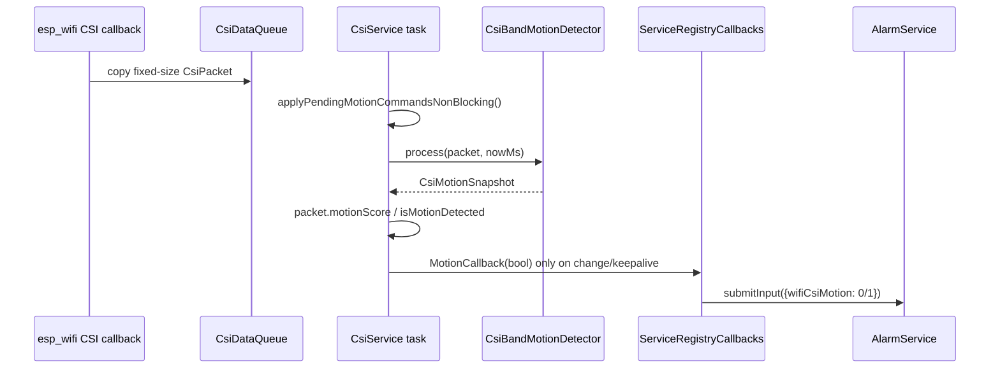

# Audyt implementacji WiFi CSI motion detection w MatrixHub

## Podsumowanie wykonawcze

Najważniejszy wniosek z audytu jest prosty: **na aktualnym `main` MatrixHub większość architektury, o którą prosisz, już istnieje w kodzie**. Repo ma osobny detektor CSI, osobną konfigurację `csi_alarm`, osobny stan runtime, osobny most do alarmów przez callback boolowy, osobny enum/source `WifiCsiMotion` oraz UI wyboru pasm na stronie CSI. Innymi słowy: to nie jest już temat „jak to zaprojektować od zera”, tylko raczej **jak to domknąć, ujednolicić dokumentację, wzmocnić testy i dopracować kilka detali architektonicznych**. citeturn13view0turn13view1turn14view0turn16view0turn13view10turn13view16

Jednocześnie repo ma **wyraźny drift dokumentacji względem kodu**. Dokument `docs/engineering/integrations/csi.md` nadal twierdzi, że CSI nie jest źródłem alarmowym i że `motionScore`/`isMotionDetected` są zerowane, a `csi-alarms-plan.md` nadal opisuje CSI alarmy jako „jeszcze niewłączone”. Kod przeczy temu wprost: istnieje aktywny `AlarmSource::WifiCsiMotion`, konfiguracja CSI alarmu, status motion oraz callback wpięty do `AlarmService`. To jest dziś największe ryzyko operacyjne, bo człowiek patrzący tylko na docs wyciągnie błędne wnioski o stanie systemu. citeturn12view2turn12view3turn12view4turn12view5turn13view0turn16view0

Dla ESP32-S3 z PSRAM kierunek jest dobry. Hot path RX callback jest copy-only, bez heapu, bez logowania i bez ciężkiej obróbki; praca dzieje się w istniejącym tasku `CsiService::processingTask`; batch buffer i storage detektora są kierowane do PSRAM; task tworzony jest statycznie przez `xTaskCreateStaticPinnedToCore`, a callback CSI jest zgodny z wymaganiami ESP-IDF, gdzie wskaźnik do `wifi_csi_info_t` przestaje być ważny po wyjściu z callbacka, więc kopiowanie jest konieczne. citeturn17view7turn13view21turn17view6turn13view22turn13view23turn13view24turn8view0turn8view3turn8view4

Moja rekomendacja końcowa: **nie przebudowuj architektury**. Zostaw obecny model:
`CSI packets -> CsiBandMotionDetector -> bool motion/state snapshot -> AlarmService`.  
Dokończ tylko to, czego jeszcze brakuje do „production confidence”: uczyń backend autorytatywnym dla `sensitivity`, zaktualizuj dokumentację, dołóż test reconnect/gain-reset i ewentualnie doprecyzuj statusy diagnostyczne. Algorytmicznie obecny kierunek jest właściwy dla embedded: per-subcarrier energy, baseline, noise floor, z-score, top-K, hysteresis, hold/clear-hold i auto-recalibration przez EWMA. citeturn19view0turn19view1turn19view2turn18view2turn18view4turn18view6turn18view7turn18view10

## Stan repozytorium i najważniejsze ustalenia

Backend CSI ma już wydzielonych konsumentów `Frontend`, `AlarmSystem` i `Boot`, a `CsiService::setMotionConfig()` aktywuje konsumenta alarmowego niezależnie od UI. W praktyce oznacza to, że CSI może działać headless jako źródło alarmu, bez otwartej strony przeglądarki. To jest dokładnie ta separacja, o którą chodziło: alarmy nie muszą wiedzieć nic o pasmach, waterfallu ani amplitudach. citeturn14view4turn14view5turn14view6turn14view0

Po stronie alarmów istnieje już osobny `AlarmSource::WifiCsiMotion = 8`, evaluator odczytuje `wifiCsiMotion`, a registry callback mapuje motion bool z CSI na `0.0f/1.0f` do `AlarmInputData`. To jest spójne z Twoim wymaganiem „alarmy dostają tylko true/false, score co najwyżej diagnostycznie”. Score pozostaje w warstwie CSI/status/UI, a logika alarmowa konsumuje prosty sygnał boolopodobny. citeturn13view0turn13view1turn16view0turn16view1

Konfiguracja jest już rozbita prawidłowo: RTC trzyma osobne pola CSI alarmu, JSON config serializuje je do `csi_alarm`, a `WifiSensingSettings` tłumaczy to na `CsiMotionConfig` i przekazuje do `CsiService`. Dzięki temu CSI nie miesza się z historycznym RSSI `wifi_motion`; współdzielony jest tylko kontener ustawień `WifiSensingData`, nie sama logika detectora. citeturn13view6turn13view2turn13view3turn13view4turn13view5

Frontend również jest już bardzo blisko targetu. Strona CSI ma dedykowany `selectionMode`, osobne `CsiAlarmControls`, overlay pasm na amplitude i waterfall, wybór pasma myszą oraz osobny przycisk kalibracji. To rozwiązuje konflikt z uPlot zoom w najzdrowszy możliwy sposób: nie próbować łączyć dwóch gestów na tym samym kanale inputu, tylko przełączać tryb interakcji. citeturn13view10turn13view11turn13view12turn13view13turn13view14


Warto podkreślić, że interfejs graficzny z załączonego widoku dobrze potwierdza sens Twojej intuicji: zmiany istotne detekcyjnie pojawiają się jako **wąskie, lokalne pasma**, a nie jako jednolite przesunięcie całego widma. To jest zgodne zarówno z praktyką zrzutu CSI, jak i z literaturą, gdzie wykorzystuje się cechy fine-grained oraz selekcję podzbiorów subcarrierów zamiast prymitywnej globalnej średniej. citeturn7search1turn7search14turn7search22

## Ocena algorytmu i rekomendacja dla ESP32-S3

Aktualny detektor robi to, co dla ESP32-S3 z PSRAM ma najlepszy stosunek skuteczności do kosztu obliczeniowego: przelicza I/Q na energię z kompensacją gainu, buduje baseline na podstawie serii ramek, wyznacza per-subcarrier noise floor, liczy **per-subcarrier z-score**, a potem składa wynik jako średnią z **top-K** najwyższych odchyleń tylko w zaznaczonych pasmach. Nad tym działa hysteresis `enter/clear`, `holdMs`, `clearHoldMs`, noise gate i auto-recalibration przez EWMA, gdy system jest spokojny. To jest architektura sensowna i produkcyjna dla embedded. citeturn19view3turn19view4turn19view0turn19view1turn19view2turn18view2turn18view4turn18view6turn18view7turn18view10

W praktyce oznacza to, że **nie rekomenduję przechodzenia na pełny MAD w firmware jako domyślną ścieżkę online**. MAD jest statystycznie bardziej odporny, ma 50% breakdown point, ale przy sensownym użyciu wymaga okna i operacji porządkowania albo aproksymacji kwantyli, co podnosi koszt i komplikuje implementację w hot path workerowym. Standard deviation liczony metodą Welforda, obłożony `minNoise`, `minEnergy`, top-K i noisy-gate, jest na MCU dużo bardziej proporcjonalny. MAD można dorzucić później jako tryb eksperymentalny offline/harnessowy do strojenia progów, nie jako obowiązkową ścieżkę runtime. citeturn11search0turn11search1turn11search9turn19view1turn19view2

To podejście jest też dobrze zgodne z literaturą WiFi sensing. Prace takie jak **E-eyes** i **FIMD** pokazują, że ziarno informacyjne tkwi w fine-grained CSI i w lokalnych zmianach subcarrierów, a nie w prostych sygnałach zagregowanych globalnie. Z kolei **WiDetect** naciska na ograniczanie false alarmów i wykorzystywanie statystycznych kryteriów odpornościowych dla detekcji ruchu. Innymi słowy: Twoja intuicja „wąskie pasma + odporność na szum + hysteresis” jest trafna i spójna z kierunkiem badawczym, ale na MCU trzeba ją zrealizować możliwie lekko. citeturn7search0turn7search1turn7search14turn7search22

Moja rekomendowana polityka algorytmiczna dla MVP jest więc następująca:

```text
1. Przelicz IQ -> energy po gain compensation.
2. Na wybranych pasmach trzymaj per-carrier mean + sigma.
3. Sigma licz z kalibracji quiet-room, potem adaptuj tylko przez EWMA gdy:
   - brak motion,
   - brak noisy state,
   - score < clear_threshold.
4. Dla każdej ramki licz z-score na carrier.
5. Odrzuć carry z mean < min_energy lub niefinity.
6. Policz score jako średnia top-K z-score tylko z wybranych carrierów.
7. MotionCandidate gdy score >= enter_threshold.
8. MotionConfirmed dopiero po hold_ms.
9. Clear dopiero po score < clear_threshold przez clear_hold_ms.
10. NoisyEnvironment gdy top-K score lub global_high_ratio utrzymują się zbyt szeroko.
```

To niemal 1:1 odpowiada temu, co dziś siedzi w repo, i właśnie dlatego oceniam obecną implementację jako dobrą bazę, a nie jako coś do wymiany. citeturn18view2turn18view4turn18view6turn18view7turn13view26turn18view10

### MAD czy stddev

Jeżeli pytanie brzmi „co jest obiektywnie lepsze?”, odpowiedź brzmi: **MAD lepszy statystycznie, stddev lepszy implementacyjnie tutaj**. MAD chroni przed outlierami i pikami statycznymi, ale obecny pipeline już częściowo broni się przed nimi przez selekcję pasm, top-K oraz `hold/clearHold`. Na ESP32-S3 koszt dodania prawdziwego MAD dla 64–256 subcarrierów w czasie rzeczywistym nie daje dziś wystarczająco dużego zysku względem obecnego modelu. Dlatego zostawiłbym MAD jako opcję badawczą w harnessie, a w firmware utrzymał obecny Welford + EWMA. citeturn11search0turn11search1turn19view1turn18view10

### Manualny wybór pasm

Tak — **manualny wybór 1–4 pasm to dobra architektura MVP**. Repo już narzuca limit 4 pasm po stronie typów i walidacji, a UI i config też są na to przygotowane. To bardzo rozsądny kompromis między używalnością a złożonością. Dodatkowo code path już ignoruje pasma nieważne przez `minEnergy` i maskę `valid`, więc „puste” subcarrier’y nie powinny demolować wyniku. citeturn10view12turn13view2turn13view14turn19view1

Auto-sugestię dobrych pasm warto dodać dopiero później. Najprostsza sensowna wersja to nie „AI”, tylko ranking pasm po dwóch metrykach: niski quiet-noise i wysoka powtarzalna separacja podczas ruchu testowego. Innymi słowy: pokaż użytkownikowi sugestię, ale nie zabieraj ręcznego wyboru. W MVP zostawiłbym manual selection jako źródło prawdy. citeturn7search14turn7search22turn12view5

## Pipeline, odpowiedzialności i pliki

Docelowy pipeline powinien pozostać dokładnie taki:

```mermaid
flowchart LR
    A[WiFi CSI RX callback] --> B[CsiDataQueue]
    B --> C[CsiService processingTask]
    C --> D[CsiGainController]
    D --> E[CsiBandMotionDetector]
    E --> F[CsiMotionSnapshot]
    F --> G[MotionCallback bool]
    G --> H[AlarmService submitInput]
    H --> I[AlarmEvaluator]
    C --> J[/ws/csi binary stream]
    F --> K[/api/wifisensing/status]
```

Taki rozdział jest zdrowy, bo alarmy nie znają szczegółów CSI, a CSI nie zna reguł alarmowych. Repo już jest praktycznie tak zbudowane. RX callback tylko kopiuje do kolejki; worker tej samej usługi robi gain compensation, motion processing, snapshot publish i WebSocket batching; bridge do alarmów siedzi wyżej, w `ServiceRegistryCallbacks`. citeturn17view7turn17view6turn17view0turn17view1turn17view3turn14view2turn16view0



Poniżej masz najważniejszą mapę plików. Traktuj ją jako „gdzie dotknąć kodu”, ale z komentarzem, że w obecnym `main` większość z tych zmian już jest.

| Plik | Rola | Stan po audycie |
|---|---|---|
| `src/wifisensing/csi/core/CsiServiceCallback.cpp` | hot path RX callback, copy-only, throttling | **dobrze**; nie dodawać tu logiki detectora citeturn13view21turn17view4turn17view6turn17view7 |
| `src/wifisensing/csi/core/CsiServiceTask.cpp` | jedyny worker CSI, gain + detector + batching | **dobrze**; zostawić jako miejsce obróbki runtime citeturn17view0turn17view1turn17view2turn17view3 |
| `src/wifisensing/csi/algo/CsiBandMotionDetector.*` | cały detector CSI motion | **główna implementacja**; tu stroić algorytm, nie w alarmach citeturn19view0turn19view1turn19view2turn18view2turn18view10 |
| `src/wifisensing/WifiSensingSettings.cpp` | translacja RTC/JSON -> `CsiMotionConfig` | **dobrze**; zachowuje separację config/runtime citeturn13view4turn13view5 |
| `src/system/rtc/types/RtcWifiSensingTypes.h` | trwała konfiguracja `csi_alarm` | **już zawiera** pola CSI alarmu citeturn13view6 |
| `src/config/json/WifiSensingConfigJson.cpp` | walidacja i serializacja `csi_alarm` | **dobrze**; clampy są już na miejscu citeturn13view2turn13view3 |
| `src/api/wifisensing/WifiSensingApiService.cpp` | `/api/wifisensing/status`, `/api/wifisensing/csi/calibrate`, `/ws/csi` | **już gotowe**; dodałbym tylko ewentualnie więcej diagnostyki citeturn13view7turn13view8turn13view9 |
| `src/alarms/types/AlarmEnums.h` | nowe źródło alarmu | **już jest** `WifiCsiMotion` citeturn13view0 |
| `src/alarms/engine/AlarmEvaluator.h` | mapowanie źródła na wartość wejściową | **już jest** obsługa `wifiCsiMotion` citeturn13view1 |
| `src/system/services/ServiceRegistryCallbacks.cpp` | bridge CSI -> AlarmService | **już jest** bool → `0/1` citeturn16view0turn16view1 |
| `interface/src/routes/wifisensing/csi/+page.svelte` | strona CSI | **już ma** controls + charts + selection mode citeturn13view10turn13view11 |
| `interface/src/lib/features/wifisensing/csi/CsiAmplitudeChart.svelte` | zaznaczanie pasm myszą | **już ma** overlay selection layer, dobry wzorzec vs zoom citeturn13view12turn13view13 |
| `interface/src/lib/features/wifisensing/csi/useCsiAlarmConfig.svelte.ts` | defaults, save/reset/calibrate, clampy | **już ma** prawie wszystko; tutaj jest jedno z miejsc do uporządkowania `sensitivity` citeturn13view14turn13view15 |
| `interface/src/lib/types/domain/alarms.ts` | frontend source string `wifi_csi_motion` | **już jest** i oznaczone jako boolean-like citeturn13view16 |
| `interface/src/lib/features/alarms/components/alarmThresholdConfig.ts` | threshold UX dla źródeł alarmów | **już jest** boolean-like mapping dla CSI citeturn13view17 |
| `docs/engineering/integrations/csi.md` | runtime docs | **do pilnej aktualizacji**, dziś nie odpowiada kodowi citeturn12view2turn12view3 |
| `docs/engineering/integrations/csi-alarms-plan.md` | plan/historyczny design note | **do aktualizacji albo archiwizacji**, obecnie historycznie nieaktualny citeturn12view4turn12view5 |

## Najważniejsze rekomendacje zmian

### Uczyń firmware autorytatywnym dla `sensitivity`

Aktualnie `sensitivity` jest zapisywane w configu, ale praktyczny wpływ na progi nakłada głównie frontend przez `applySensitivity()`. To oznacza, że klient API inny niż UI może zapisać sprzeczne wartości: `sensitivity=2`, ale progi ręcznie ustawione inaczej. To nie jest krytyczny bug, ale jest to **dryf odpowiedzialności**. Firmware powinien być source of truth dla tego, co oznacza `sensitivity`. citeturn13view15turn18view0

Moja rekomendacja jest binarna; wybierz jedną z dwóch dróg:

```diff
- frontend zapisuje sensitivity i jednocześnie mutuje enter/clear thresholds
+ frontend zapisuje tylko sensitivity albo tryb "manual/preset"
+ backend normalizuje config do finalnych progów
```

Albo, jeśli chcesz pełną ręczną kontrolę:

```diff
- trzymaj w configu sensitivity
+ usuń sensitivity z trwałej konfiguracji
+ traktuj to wyłącznie jako helper UI, który tylko podpowiada wartości
```

Dla Codex Goal Mode lepsza jest pierwsza opcja, bo daje spójniejszy kontrakt backendowy.

### Zaktualizuj dokumentację przed kolejnym etapem

To jest zmiana o bardzo wysokiej wartości i niskim koszcie. Obecne docs mówią, że CSI alarmy nie są wdrożone, podczas gdy kod już je wdraża. To stwarza ryzyko błędnych decyzji wdrożeniowych, testowych i review. Zmieniaj docs razem z kodem albo od razu oznacz stare plany jako historyczne. citeturn12view2turn12view3turn12view4turn12view5

Minimalny diff koncepcyjny:

```diff
- CSI is not enabled as a production alarm source yet.
+ CSI alarm path is implemented as wifi_csi_motion.
+ AlarmService consumes only boolean-like motion state.
+ csi.motion.score/confidence remain diagnostic.
```

### Dodaj test reconnect/gain-reset i status reset reason

Historyczny plan słusznie wskazywał reconnect-period i gain reset jako źródła false positive. W obecnym kodzie jest kompensacja gainu i reset baseline przy zmianie szerokości, ale nadal dołożyłbym jawny test na sekwencję:
quiet → reconnect/gain disturbance → quiet. Jeśli detektor wejdzie w `MotionCandidate` tylko z powodu resetu ścieżki radiowej, to alarm może być zbyt nerwowy. citeturn12view4turn12view5turn19view3turn17view1

Najmniejsza sensowna poprawka diagnostyczna to dołożenie w `CsiMotionSnapshot` pola typu `lastResetReason` albo `resetReason`, które zwracałoby np. `manual_calibration`, `width_change`, `config_change`, `unavailable_storage`, `quiet_auto_recalibration`. To nie musi wpływać na evaluator, ale bardzo pomoże stroić system w terenie. Historyczny plan sam wskazywał potrzebę `last reset reason` w statusie. citeturn12view5

### Nie dokładaj osobnego RTOS tasku

Tu rekomendacja jest stanowcza: **nie dodawaj nowego tasku**. Obecna implementacja już spełnia zdrów model embedded: ISR robi minimalne kopiowanie, a `CsiService::processingTask` robi całą resztę. Dodanie osobnego tasku detectora tylko zwiększy koszty synchronizacji, kolejki i ryzyko dryfu lifecycle. Na ESP-IDF statyczne taski z przypięciem do rdzenia są sensowne, ale nie mnoży się ich bez potrzeby. citeturn17view0turn17view1turn8view4

### Nie przenoś alarmowej wiedzy do warstwy CSI UI

UI powinno służyć do:
- wyboru pasm,
- kalibracji,
- podglądu statusu,
- strojenia progów.

Nie powinno stać się miejscem, gdzie powstaje finalny sygnał alarmowy. Tę granicę repo obecnie trzyma poprawnie: UI zapisuje config, C++ detektor liczy motion, a alarmy dostają tylko wartość boolopodobną. Tę separację trzeba zachować. citeturn13view10turn13view11turn14view2turn16view0

## Domyślne wartości, edge-case’y i testy

Sensowne wartości domyślne są już praktycznie ustalone w repo i ja bym ich na MVP nie ruszał: `baseline_frames=150`, `top_k=8`, `enter_threshold=6`, `clear_threshold=3`, `hold_ms=1200`, `clear_hold_ms=2500`, `min_noise=4`, `min_energy=4`, `noisy_threshold=80`, `auto_recalibration=true`, `sensitivity=1`. To jest zestaw konserwatywny, lekki i zgodny z obecną implementacją firmware/UI. citeturn10view12turn13view14turn18view0

Najważniejsze edge-case’y, które trzeba traktować jako produkcyjne, są następujące. Pierwszy to **false positives od globalnego szumu**, dlatego noise gate i `NoisyEnvironment` są potrzebne; drugi to **statyczne piki / martwe subcarriery**, dlatego selekcja pasm i maska `valid` są ważniejsze niż globalna średnia; trzeci to **gain compensation / reconnect**, bo stan radiowy może zmienić amplitudy bez realnego ruchu; czwarty to **packet loss / throttling**, bo callback CSI jest specjalnie ograniczany z myślą o stabilnym strumieniu; piąty to **headless operation**, czyli alarm ma działać bez strony CSI. Obecny kod ma już odpowiedzi na część z tych punktów, ale reconnect/gain reset nadal jest miejscem, które warto dociążyć testami. citeturn13view26turn19view1turn17view5turn14view0turn12view5

Obszar testów też jest już mocno rozbudowany. Repo ma natywne testy detektora dla baseline convergence, narrow-band motion, global noise, clear hold oraz dead carriers, a do tego osobny harness Pythona dla syntetycznych scenariuszy quiet/motion/noisy. To jest dobra baza pod acceptance testing; brakuje mi głównie testu reconnect/gain-reset i być może testu „zły wybór pasma przez usera”. citeturn13view18turn13view19turn13view20

Przykładowy pseudotest, który bym dołożył po stronie C++:

```cpp
void test_reconnect_or_gain_jump_does_not_trigger_motion() {
    CsiBandMotionDetector detector;
    TEST_ASSERT_TRUE(detector.begin());

    auto cfg = enabledConfig();
    detector.configure(cfg);
    trainBaseline(detector, cfg);

    // symulacja zaburzenia gain/reconnect
    auto disturbed = makePacket(kWidth, 10);
    disturbed.compensate_gain = 1.8f;
    auto snapshot = detector.process(disturbed, 5000);

    TEST_ASSERT_FALSE(snapshot.motion);
    TEST_ASSERT_TRUE(
        snapshot.state == CsiMotionState::Calibrating ||
        snapshot.state == CsiMotionState::Monitoring ||
        snapshot.state == CsiMotionState::NoisyEnvironment
    );
}
```

A przykładowe komendy testowe dla MVP strojenia powinny wyglądać tak:

```bash
pio test -e native -f test_csi_band_motion_detector
pio test -e native -f test_wifi_sensing_config_json
pio test -e native -f test_alarm_evaluator
python -m unittest test/test_csi_alarm_harness.py
```

To są najbardziej wartościowe szybkie testy dla tej ścieżki, bo pokrywają detector, konfigurację i alarm bridge. Ich sens wynika bezpośrednio z istniejących targetów testowych w repo. citeturn13view18turn13view19turn13view20turn12view1

## Plan MVP i kolejność commitów

Jeśli wdrażałbym to „jak po sznurku” do gałęzi, która jeszcze tego nie ma, to zrobiłbym to w takiej kolejności. To jest kolejność optymalna również dla Codex Goal Mode, bo minimalizuje zależności krzyżowe.

Najpierw commit z **typami i kontraktami backendu**: `CsiMotionTypes`, pola RTC/JSON `csi_alarm`, `AlarmSource::WifiCsiMotion`, `AlarmInputData::wifiCsiMotion`. Dopiero gdy kontrakt danych jest stały, jest sens dodawać algorytm i UI. citeturn10view12turn13view0turn13view6turn13view2

Potem commit z **detektorem i runtime bridge’em**: `CsiBandMotionDetector`, wpięcie do `CsiService::processingTask`, wiring `setMotionConfig`, `getMotionSnapshot`, `MotionCallback`, bridge w `ServiceRegistryCallbacks`. To jest właściwe serce funkcji. Dopiero po tym system naprawdę „żyje” headless. citeturn17view1turn17view3turn14view0turn14view2turn16view0

Następnie commit z **API i diagnostyką**: `/api/wifisensing/status`, `/api/wifisensing/csi/calibrate`, serializacja motion status, ewentualnie dodatkowe pola typu `lastResetReason`. Bez tego strojenie i smoke-testy będą uciążliwe. citeturn13view8turn13view9turn12view5

Dopiero potem commit z **frontendem CSI**: controls, selection mode, overlay pasm, calibrate button, status badge, save/reset. Ten kawałek repo również jest już de facto wdrożony, więc w praktyce chodzi bardziej o ewentualne polerowanie niż o dużą implementację. citeturn13view10turn13view11turn13view12turn13view13turn13view14

Na końcu commit z **testami i dokumentacją**. W tej chwili to właśnie ten etap oceniam jako najbardziej brakujący względem poziomu „production-ready”: nie tyle sam kod, ile spójna dokumentacja stanu i pełniejszy zestaw testów reconnect/noise. citeturn12view2turn12view3turn12view4turn12view5turn13view18turn13view20

Acceptance criteria dla MVP ustawiłbym następująco:
- zapis `csi_alarm` persistuje i wraca po restarcie,
- wyłączenie/włączenie CSI alarmu zmienia `AlarmSystem` consumer bez otwartego UI,
- `wifi_csi_motion` da się wybrać w regułach alarmowych,
- alarm evaluator reaguje na `0/1`, nie na surowe amplitudy,
- UI pozwala zaznaczyć 1–4 pasma i zobaczyć overlay,
- kalibracja działa bez restartu,
- quiet synthetic i real quiet run nie dają triggerów,
- narrow-band motion daje trigger po `hold_ms`,
- global noise daje `NoisyEnvironment`, a nie `MotionConfirmed`,
- RX callback nie dostaje dodatkowych alokacji ani ciężkiej logiki. citeturn14view0turn13view0turn13view1turn13view12turn13view13turn13view8turn13view18turn13view19turn13view21

## Otwarty bilans i ograniczenia

Największe ograniczenie tego audytu nie jest techniczne, tylko repozytoryjne: **GitHub `main` i dokumentacja nie są dziś semantycznie zsynchronizowane**. Kod wskazuje, że CSI alarm path istnieje i jest aktywny; docs mówią, że to jeszcze plan. Dlatego przed generowaniem finalnego pliku wykonawczego dla Codex warto traktować kod jako source of truth, a dokumenty planistyczne jako historyczne, dopóki ich nie odświeżysz. citeturn12view2turn12view3turn12view4turn12view5

Druga rzecz: obecny algorytm jest sensowny, ale nie ma w repo widocznego, bogatego zestawu **real captures** spiętych z automatyczną walidacją jakości alertów. To oznacza, że architektura jest dobra, testy syntetyczne też, ale końcowe strojenie progów nadal musi być zrobione na rzeczywistych danych z Twojego pomieszczenia, AP i kanału. Literatura na CSI sensing bardzo konsekwentnie pokazuje, że środowisko radiowe mocno wpływa na wynik, więc nie ma jednego „magicznego” zestawu progów dla wszystkich instalacji. citeturn7search0turn7search1turn12view4turn12view5

Końcowa rekomendacja jest więc jednoznaczna: **to już jest dobra implementacja pod ESP32-S3 z PSRAM i w dużej części spełnia Twoje pierwotne wymagania**. Nie przepisywałbym jej od nowa. Ustawiłbym dalsze prace jako:  
**docs alignment → backend authority for sensitivity → reconnect/gain-reset tests → ewentualna diagnostyka reset reason → dopiero potem eksperymenty typu MAD lub auto-band suggestion.** citeturn12view0turn13view15turn12view5turn19view3turn11search0