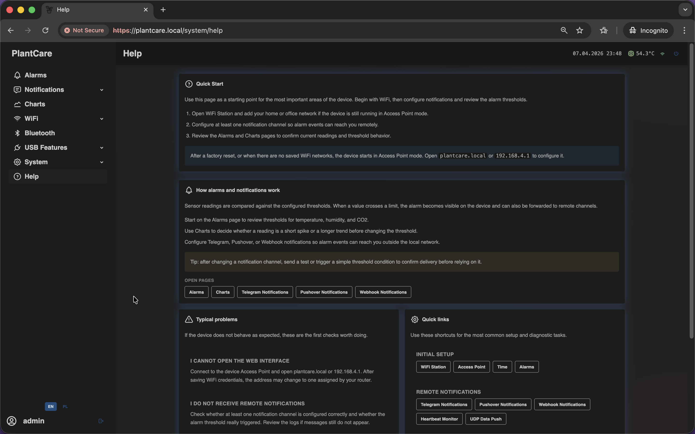
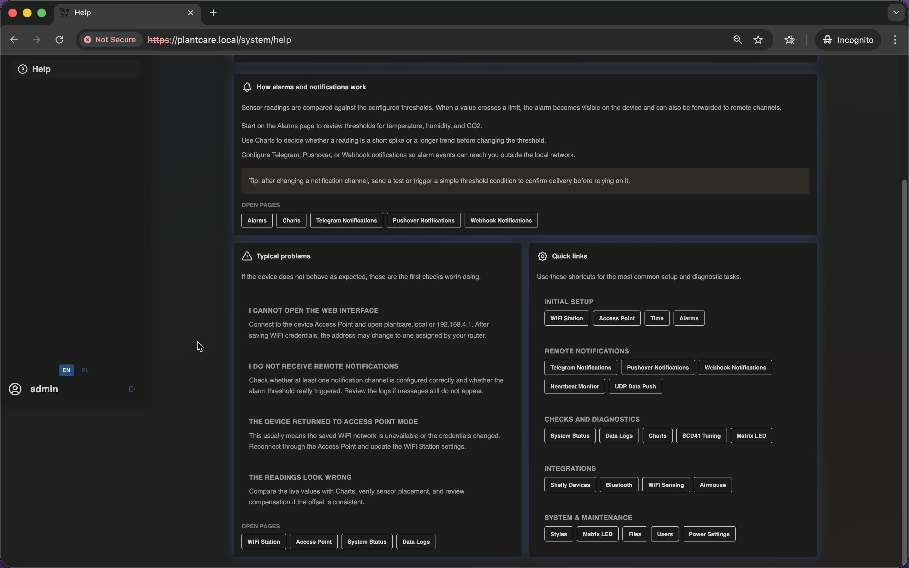

# Help Page

Navigation: [Home](../README.md) · [Special / Support Screens](README.md)

The built-in `Help` page is a support-oriented screen that groups onboarding
notes, alarm guidance, troubleshooting hints, and quick links to the most
important parts of the interface.

This is the same frontend screen used on the `/system/help` route.

## What This Page Contains

The page is organized into several support cards:

- a first-access and connection intro
- an alarm flow summary with quick links to alert-related pages
- a troubleshooting area with common issue descriptions
- grouped quick links for setup, notifications, diagnostics, integrations, and
  system pages

The upper part of the page focuses on onboarding and on the relationship
between alarms, charts, and notification channels. It is the quickest place to
send a new user when they need a guided overview without changing settings.

The lower half is more operational:

It combines common problem summaries with grouped quick links into the most
relevant setup and diagnostic pages.

## Important Behavior

- some help links are shown as disabled when they point to admin-only pages and
  the current user does not have management access
- the page is a navigation and support hub, not a settings page
- it is especially useful during onboarding, troubleshooting, or remote support

Navigation: [Home](../README.md) · [Special / Support Screens](README.md)
