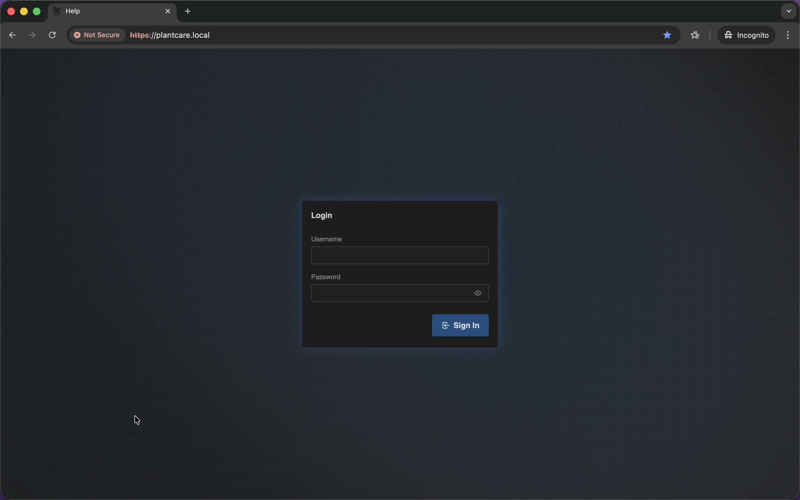

# Login Screen

Navigation: [Home](../README.md) · [Special / Support Screens](README.md)

The `Login` screen is the authentication entry point shown when MatrixHub
requires sign-in before opening the main dashboard.

## What This Page Contains

The screen includes:

- a username field
- a password field
- a `Sign In` button
- warning feedback when the previous request was unauthorized

The page is intentionally minimal, so the only action here is authentication.
Once sign-in succeeds, MatrixHub redirects to the main application instead of
using this screen as a landing page.

## Important Behavior

- the submit button switches into a loading state while the sign-in request is
  running
- invalid or unauthorized access attempts return the user to this screen with
  a visible warning
- this page is separate from user management; account creation and security
  settings live in `System -> Users`

Navigation: [Home](../README.md) · [Special / Support Screens](README.md)
