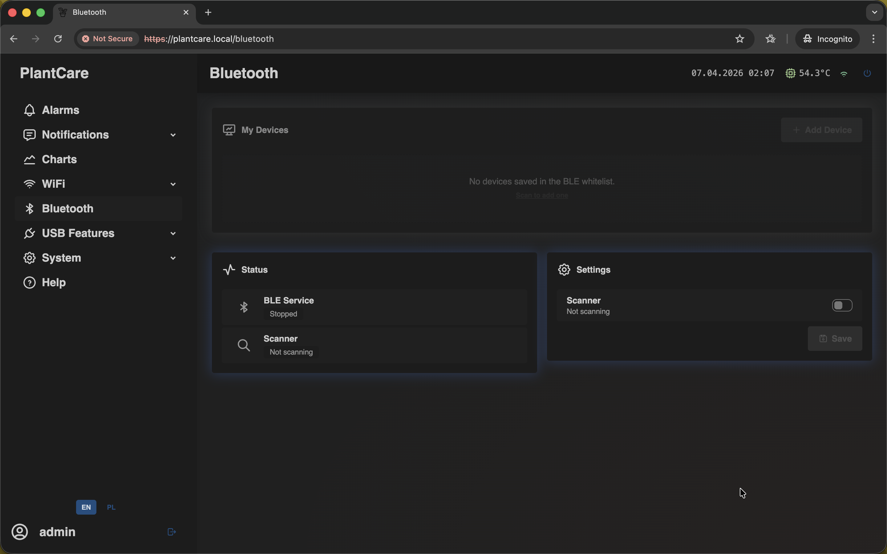
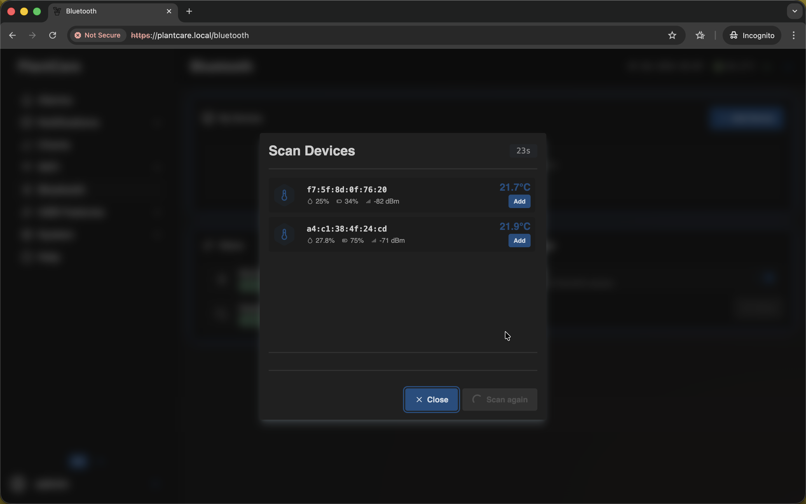
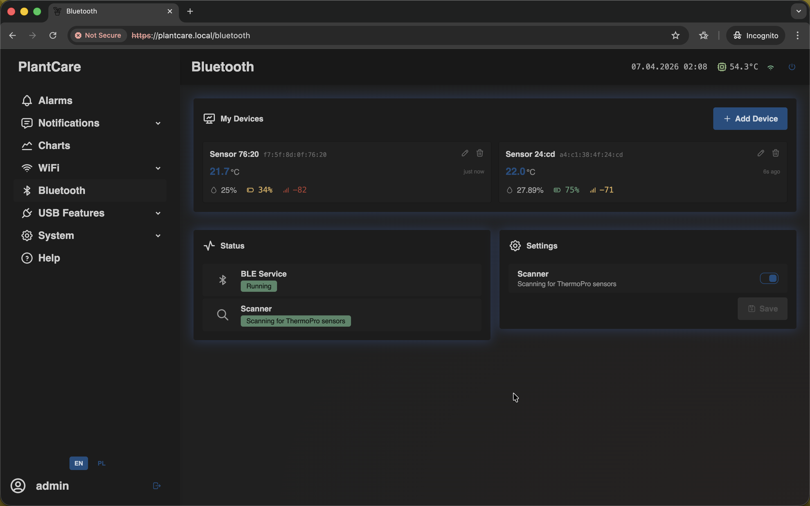
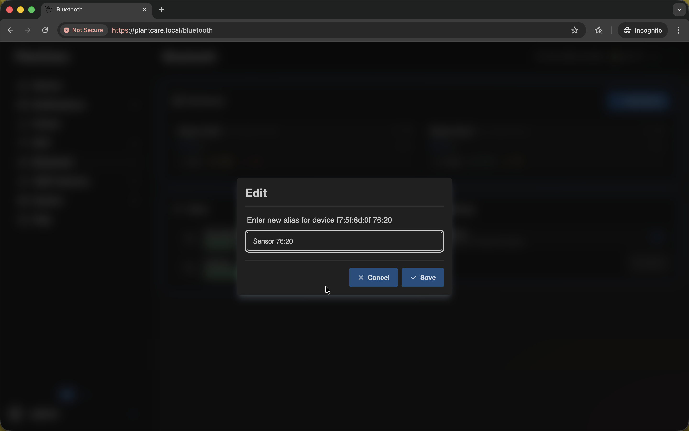

# Add a Bluetooth Sensor

Navigation: [Home](../../README.md) · [Basic Flows](../../README.md#basic-use-cases) · [Additional Flows](../../README.md#additional-use-cases) · [Reference](../../README.md#reference-sections)

Use this flow to scan for a BLE sensor and add it to the saved list.

## Goal

- scan for supported BLE sensors
- add a device to the local list
- confirm that readings appear in the interface

## Before You Start

- sign in with an account that can manage Bluetooth settings
- keep the BLE sensor awake and close to MatrixHub during the first scan
- if `Add Device` is disabled, turn on the BLE scanner in the `Bluetooth`
  settings card and save the change first

## Step 1: Open the Bluetooth page

Open `Bluetooth`.

If this is your first sensor, the page starts with an empty state and a
shortcut to begin scanning:

The page also includes a status card, a scanner toggle, and the saved device
list.

## Step 2: Start a scan

Click `Add Device` or `Scan to add`.

MatrixHub starts a timed scan and shows detected sensors with:

- MAC address
- temperature and humidity
- battery level
- RSSI signal strength

Important:

- if the scan button is disabled, the BLE scanner is still off in settings
- sensors that are already saved show as `Added`

## Step 3: Add the sensor you want to keep

When your sensor appears in the modal, click `Add`.

MatrixHub saves the sensor MAC address and creates a default alias based on the
device identity, so you can rename it later without losing the saved entry.

## Step 4: Confirm that readings appear in the saved list

After saving, the sensor moves into the main device list:

What to confirm:

- the alias is visible
- the MAC address matches the sensor you added
- temperature, humidity, battery, and RSSI values appear
- the last-update time keeps refreshing as new BLE packets arrive

If the card still shows waiting or stale data, keep the sensor awake and give
it another advertising cycle.

## Step 5: Rename the sensor for daily use

Use the edit action on the saved device row if you want a more readable name:

Good alias examples:

- `Greenhouse Left`
- `Living Room Probe`
- `Plant Shelf Sensor`

## Related Reference Sections

- [Bluetooth devices](../../sections/bluetooth.md)

Navigation: [Home](../../README.md) · [Basic Flows](../../README.md#basic-use-cases) · [Additional Flows](../../README.md#additional-use-cases) · [Reference](../../README.md#reference-sections)
