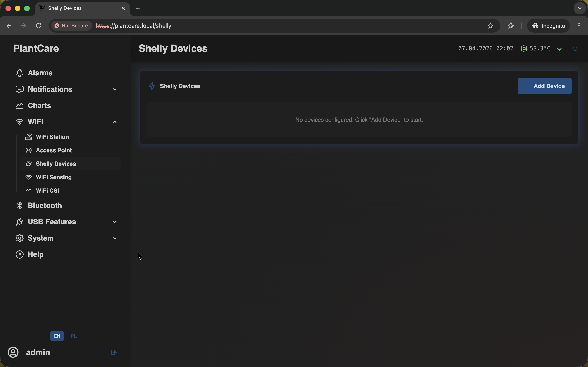
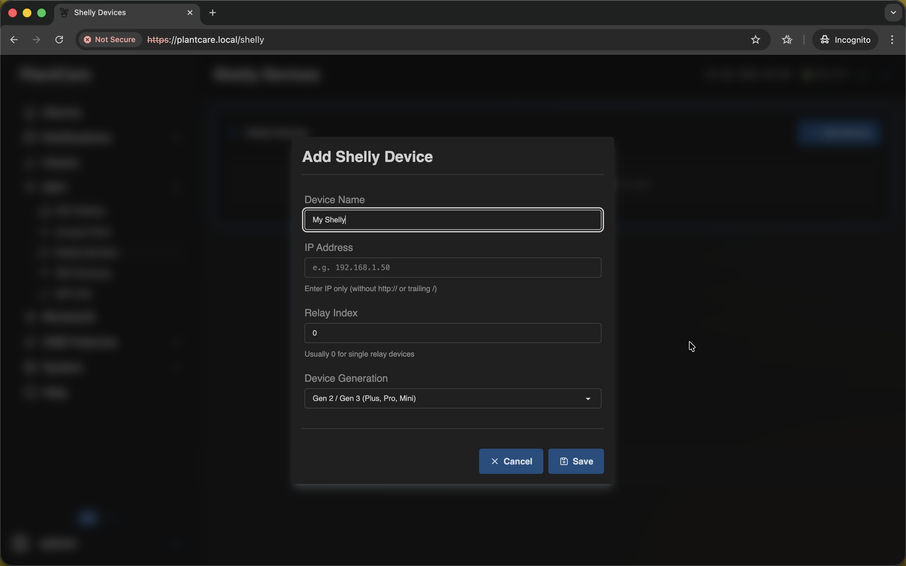
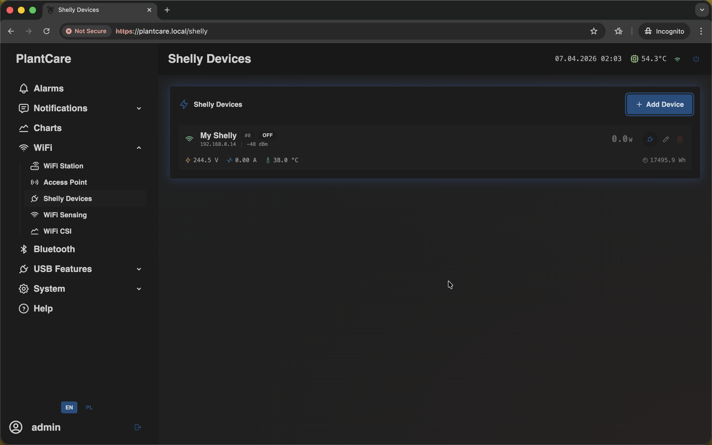

# Add a Shelly Device

Navigation: [Home](../../README.md) · [Basic Flows](../../README.md#basic-use-cases) · [Additional Flows](../../README.md#additional-use-cases) · [Reference](../../README.md#reference-sections)

Use this flow to add one Shelly device and confirm that it appears in the
integration list.

## Goal

- create the first Shelly entry
- save connection details
- confirm that telemetry appears in the list

## Before You Start

- sign in with an account that can manage integrations
- make sure MatrixHub and the Shelly device are on the same network
- know the Shelly device IPv4 address
- know which relay channel you want to monitor or control
- know whether the device is `Gen 1` or `Gen 2`

## Step 1: Open the Shelly Devices page

Open `Shelly Devices`.

If this is your first integration, the page starts with an empty list:

Use `Add Device` to open the configuration form.

## Step 2: Enter the device details

Fill in the modal with the Shelly device information:

Recommended field order:

1. `Name`: use a readable label such as `Grow Light Plug` or `Ventilation Fan`.
2. `IP Address`: enter the Shelly IPv4 address on your LAN.
3. `Relay Index`: keep `0` for the first relay unless you know the device uses
   another channel.
4. `Generation`: choose `Gen 1` or `Gen 2` so MatrixHub talks to the correct
   API style.

Important:

- the form accepts only IPv4 targets
- if you paste a full `http://...` or `https://...` device URL, MatrixHub
  trims it down to the IPv4 host automatically
- MatrixHub supports up to four saved Shelly devices

## Step 3: Save the entry

Click `Save`.

After the modal closes, the new device is added to the integration list.

## Step 4: Confirm live status and telemetry

Once the device is saved, look for it in the main list:

What to confirm:

- the device name is correct
- the IP address is correct
- the relay index badge matches the channel you intended
- the row shows online or offline state
- power, voltage, current, temperature, and energy appear when the device
  reports them

If the device stays offline, double-check the IP address, the selected
generation, and local network reachability.

## Step 5: Optionally verify relay control

If the device is online and you expect remote control, use the power button in
the row to toggle it once and confirm that MatrixHub can reach the relay.

## Related Reference Sections

- [Shelly devices](../../sections/shelly.md)

Navigation: [Home](../../README.md) · [Basic Flows](../../README.md#basic-use-cases) · [Additional Flows](../../README.md#additional-use-cases) · [Reference](../../README.md#reference-sections)
