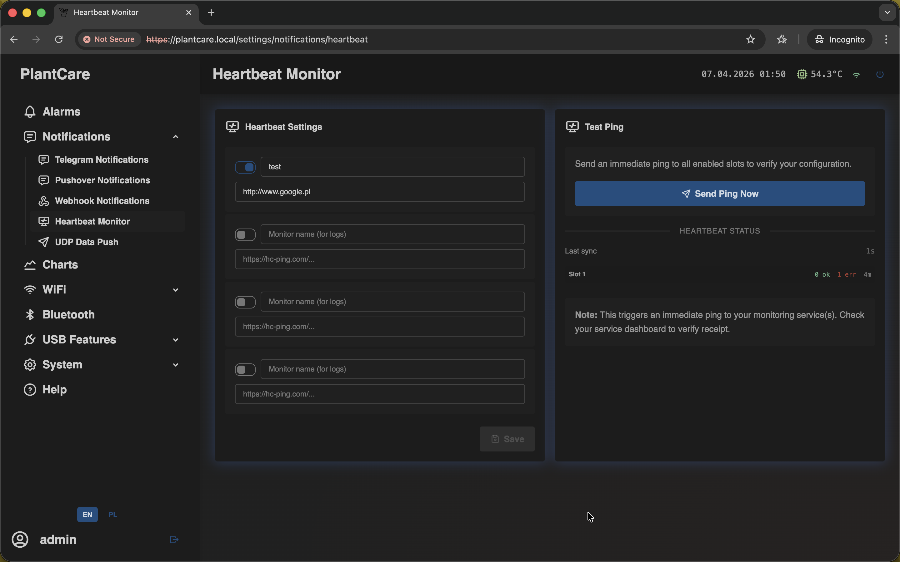

# Set Up Heartbeat Monitor

Navigation: [Home](../../README.md) · [Basic Flows](../../README.md#basic-use-cases) · [Additional Flows](../../README.md#additional-use-cases) · [Reference](../../README.md#reference-sections)

Use this flow when you want periodic "device is alive" pings in addition to
normal threshold alarms.

## Before You Start

- the device should already have working Wi-Fi access
- you need one or more heartbeat monitor URLs

## Recommended Steps

1. Open `Notifications -> Heartbeat Monitor`.

2. Enable one heartbeat slot.
3. Enter a monitor name if you want clearer logs.
4. Paste the heartbeat URL for that slot.
5. Save the settings.
6. Use `Send Ping Now` to verify that the monitoring service receives the
   request.

## What to Confirm

- the slot stays enabled after saving
- the monitor name is readable if you manage more than one heartbeat target
- `Send Ping Now` is accepted by the monitoring service before you rely on it
- the heartbeat target is treated as a separate online check, not as an alarm
  rule output

## Important

- heartbeat does not depend on alarm rules or alarm thresholds
- it is a separate online-status signal that can run alongside normal alarms
- MatrixHub supports up to `4` heartbeat slots

## Related Reference Sections

- [Notifications](../../sections/notifications.md)

Navigation: [Home](../../README.md) · [Basic Flows](../../README.md#basic-use-cases) · [Additional Flows](../../README.md#additional-use-cases) · [Reference](../../README.md#reference-sections)
