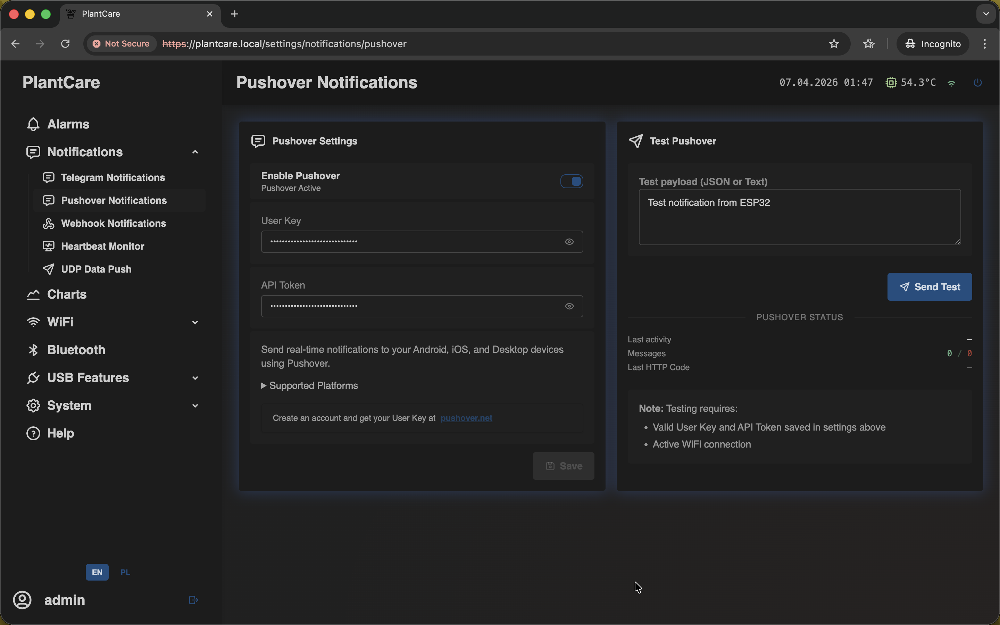

# Set Up Pushover Notifications

Navigation: [Home](../../README.md) · [Basic Flows](../../README.md#basic-use-cases) · [Additional Flows](../../README.md#additional-use-cases) · [Reference](../../README.md#reference-sections)

Use this flow when you want mobile push alerts through Pushover.

## Before You Start

- the device should already have working Wi-Fi access
- you need your `User Key` and application `API Token`

## Recommended Steps

1. Open `Notifications -> Pushover Notifications`.

2. Enable `Pushover`.
3. Enter your `User Key`.
4. Enter the application `API Token`.
5. Save the settings.
6. Use `Send Test` before you depend on alarm delivery.
7. Add `Pushover` as a channel in the alarm rule that should send remote
   alerts.

## What to Confirm

- `Pushover` stays enabled after saving
- the test push arrives on the target device before you add the channel to an
  important alarm
- the same account and app token are the ones you expect to use in production

## Important

- selecting `Pushover` in an alarm rule is not enough on its own
- the Pushover page must also be enabled and hold valid credentials
- Pushover delivery still depends on working Wi-Fi access

## Related Reference Sections

- [Notifications](../../sections/notifications.md)
- [Alarms](../../sections/alarms.md)

Navigation: [Home](../../README.md) · [Basic Flows](../../README.md#basic-use-cases) · [Additional Flows](../../README.md#additional-use-cases) · [Reference](../../README.md#reference-sections)
