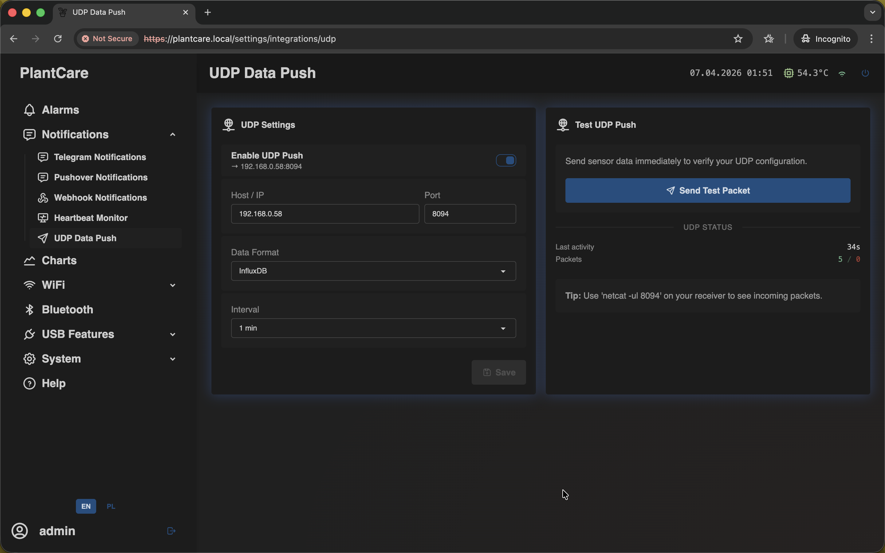

# Set Up UDP Data Push

Navigation: [Home](../../README.md) · [Basic Flows](../../README.md#basic-use-cases) · [Additional Flows](../../README.md#additional-use-cases) · [Reference](../../README.md#reference-sections)

Use this flow to stream sensor data to a local collector such as InfluxDB,
Telegraf, or another UDP listener.

## Before You Start

- the device should already have working Wi-Fi access
- you need the receiver host or IP and destination port

## Recommended Steps

1. Open `Notifications -> UDP Data Push`.

2. Enable `UDP Push`.
3. Enter the destination `Host / IP`.
4. Enter the destination `Port`.
5. Choose the `Data Format`.
6. Choose the send `Interval`.
7. Save the settings.
8. Use `Send Test Packet` to verify that the receiver sees incoming data.

## What to Confirm

- the receiver logs or displays the test packet immediately
- the selected data format matches what your collector expects
- the chosen interval is frequent enough for monitoring, but not unnecessarily
  noisy for your local network or parser

## Important

- UDP push is not selected inside alarm rules
- it sends periodic sensor data, not alarm notifications
- the receiver must be reachable from the same network path as the device

## Related Reference Sections

- [Notifications](../../sections/notifications.md)

Navigation: [Home](../../README.md) · [Basic Flows](../../README.md#basic-use-cases) · [Additional Flows](../../README.md#additional-use-cases) · [Reference](../../README.md#reference-sections)
