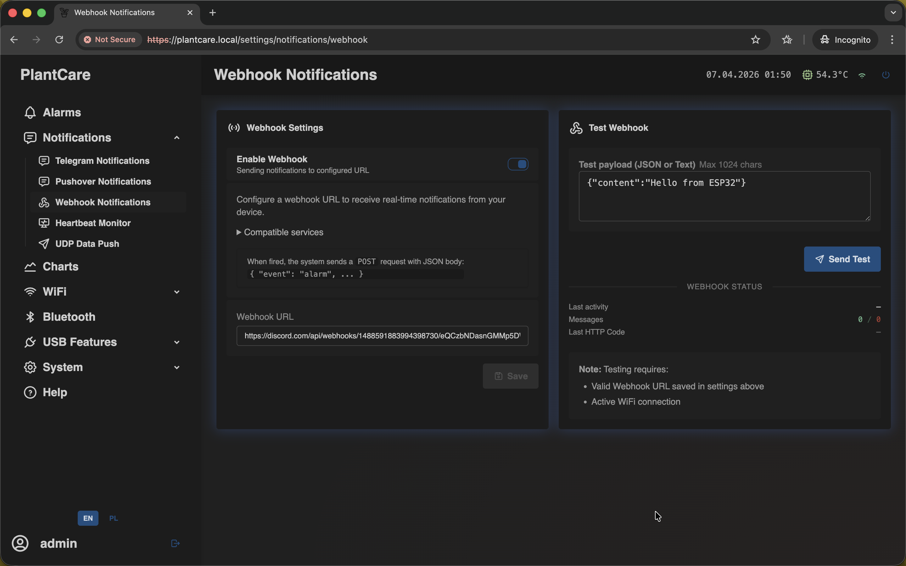

# Set Up Webhook Notifications

Navigation: [Home](../../README.md) · [Basic Flows](../../README.md#basic-use-cases) · [Additional Flows](../../README.md#additional-use-cases) · [Reference](../../README.md#reference-sections)

Use this flow to deliver alarm events to an external service over HTTP or
HTTPS, including Discord webhooks.

## Before You Start

- the device should already have working Wi-Fi access
- you need a valid webhook URL from your receiver or automation service

## Recommended Steps

1. Open `Notifications -> Webhook Notifications`.

2. Enable `Webhook`.
3. Paste the destination `Webhook URL`.
4. Save the settings.
5. Use `Send Test` to verify that the receiver accepts the request.
6. Add `Webhook` as a channel in the alarm rule that should trigger remote
   delivery.

## What to Confirm

- the test request reaches the correct service or Discord channel
- the receiver accepts the payload before you attach the channel to a live alarm
- the stored webhook URL is the production endpoint you intend to use

## Important

- selecting `Webhook` in an alarm rule is not enough on its own
- the Webhook page must also be enabled and hold a valid destination URL
- webhook delivery still depends on working Wi-Fi access
- Discord webhook URLs are supported directly
- when MatrixHub detects a Discord webhook URL, it automatically formats text
  payloads with the `content` field expected by Discord
- treat the webhook URL as a secret
- the test editor also switches its default example payload automatically for
  Discord

## Related Reference Sections

- [Notifications](../../sections/notifications.md)
- [Alarms](../../sections/alarms.md)

Navigation: [Home](../../README.md) · [Basic Flows](../../README.md#basic-use-cases) · [Additional Flows](../../README.md#additional-use-cases) · [Reference](../../README.md#reference-sections)
