# Add Your First Alarm Rule

Navigation: [Home](../../README.md) · [Basic Flows](../../README.md#basic-use-cases) · [Additional Flows](../../README.md#additional-use-cases) · [Reference](../../README.md#reference-sections)

Start with one simple local rule using `LED`. This is the fastest way to verify
that alarms work before adding Telegram, Webhook, or Pushover.

## Goal

- create the first alarm rule
- learn the difference between `enabled`, `triggered`, and `notified`
- understand the few alarm behaviors that are not obvious from the UI

## Video Demo

If you want to see a real dashboard -> alarms -> Telegram flow first, watch:
[This Device Warns Me About High CO2 and Sends It to Telegram](https://youtu.be/uUkitUXndD8?si=6oeI0EoqvSQORf07)

## Before You Start

- sign in with an account that can manage alarms
- make sure the device is already collecting sensor data

## Step 1: Open the Alarms page

Open `Alarms` from the main menu.

If no rules are configured yet, the page shows an empty state and an
`Add Rule` button. MatrixHub supports up to `8` alarm rules.

## Step 2: Create a simple starter rule

Click `Add Rule`.

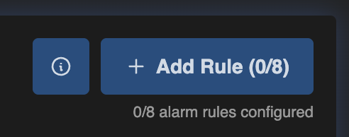

The full modal looks like this:

Use the controls in this order:

1. Leave the generated name or type your own.

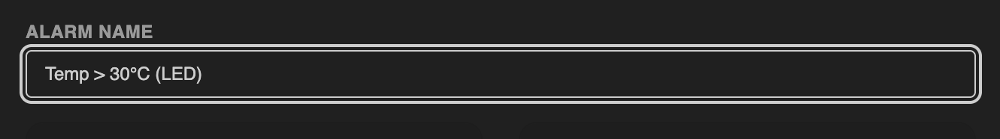

2. Pick the source you want to watch.

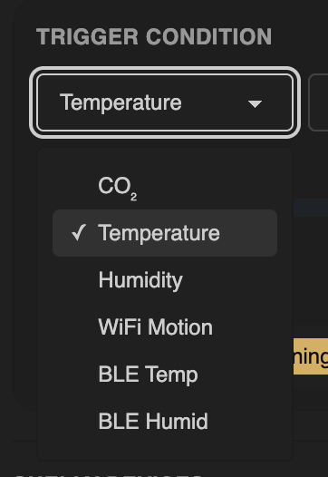

3. Choose whether the alarm should trigger `Above` or `Below` the threshold.

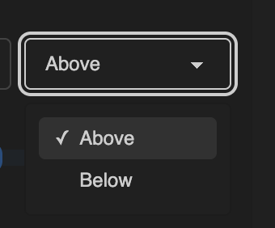

4. Set the threshold and select a severity.

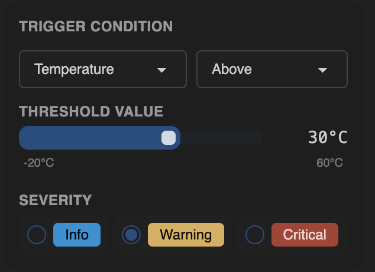

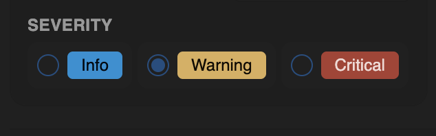

Recommended first test:

- source: `Temperature`
- operator: `Above`
- threshold: `30°C`
- severity: `Warning`

5. In `Actions`, keep `LED` enabled for the first local test.

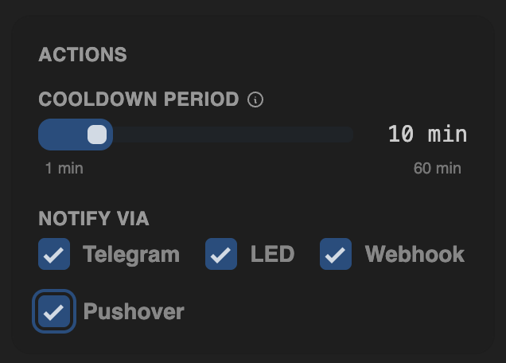

Important:

- `LED` is the simplest local channel
- `Telegram`, `Webhook`, and `Pushover` depend on their own configuration pages
- the cooldown control appears when remote channels are selected

6. `Shelly Devices` is optional. You can skip it for the first alarm.

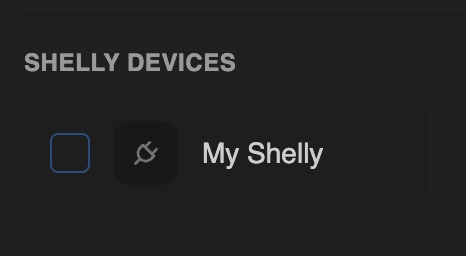

7. Click `Create Alarm`.

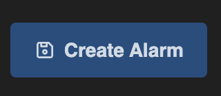

After saving, the rule is added to the alarm list and starts participating in
alarm evaluation.

## Step 3: Confirm that the rule was saved correctly

After saving, the rule should appear in the list on the `Alarms` page.

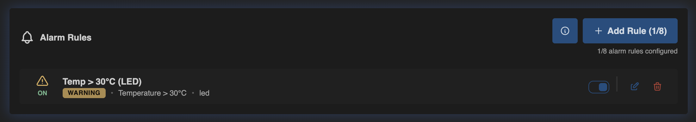

This view helps you confirm that the rule definition is correct:

- the rule name is visible
- the severity badge is visible
- the condition summary is visible
- the selected channel is visible
- the `ON/OFF` toggle shows whether the rule is active
- edit and delete actions are available on the right

In the example above, the rule is saved and `ON`. That means the rule is active
and MatrixHub is evaluating it, but it does not automatically mean the alarm is
currently triggered.

## What Actually Matters

- `Info`, `Warning`, and `Critical` are severity levels. They do not change the
  threshold logic, but they do affect how active LED alarms are prioritized.
- `LED` is local and does not depend on internet access.
- `Telegram`, `Webhook`, and `Pushover` only work if those channels are also
  enabled and configured correctly in `Notifications`.
- Cooldown limits repeated notifications for the same active alarm. It does not
  delay the first notification.
- `enabled`, `triggered`, and `notified` are different states:
  - `enabled`: the rule is active
  - `triggered`: the current value crosses the threshold
  - `notified`: MatrixHub decided it should send an output now

## About the ON/OFF Toggle

- `ON` means the rule is evaluated.
- `OFF` means the rule stays saved but is ignored.
- Toggling a rule does not work like a dedicated manual `Send now` button.
- In the current design, alarm changes are saved as one full ruleset snapshot.
  Because of that, toggling or editing one rule can re-arm other already-active
  rules and they may notify again on the next evaluation pass.

## How a Triggered Alarm Looks on the Dashboard

Once an enabled rule crosses its threshold, the dashboard highlights it as an
active alarm.

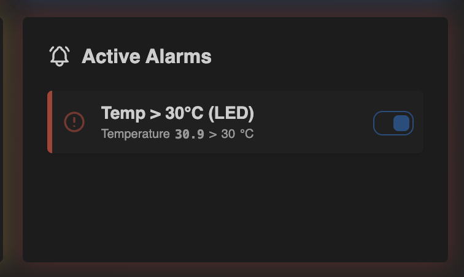

This screenshot shows an alarm that is already active:

- the rule name is still the same: `Temp > 30°C (LED)`
- the current reading is shown directly next to the threshold
- the comparison is visible as `30.9 > 30 °C`
- the card is highlighted in red because the rule is currently triggered

This is the easiest visual difference to remember:

- `saved and ON` means the rule is active and ready to evaluate
- `shown as active on the dashboard` means the condition is currently true

The dashboard toggle follows the same rules as the main `Alarms` page.

## Common Mistakes

- The rule is saved but still `OFF`.
- The threshold is not actually crossed yet.
- A remote channel is selected in the rule, but that channel is not enabled or
  not fully configured in `Notifications`.
- Toggling or editing one rule can cause another already-active rule to notify
  again. In the current design this is expected, because alarm changes are
  applied as one full snapshot.
- You expect cooldown to delay the first alert. It does not. It only limits
  repeat notifications while the alarm stays active.

## Related Reference Sections

- [Alarms](../../sections/alarms.md)
- [Notifications](../../sections/notifications.md)
- [Set up Telegram notifications](setup-telegram-notifications.md)

Navigation: [Home](../../README.md) · [Basic Flows](../../README.md#basic-use-cases) · [Additional Flows](../../README.md#additional-use-cases) · [Reference](../../README.md#reference-sections)
