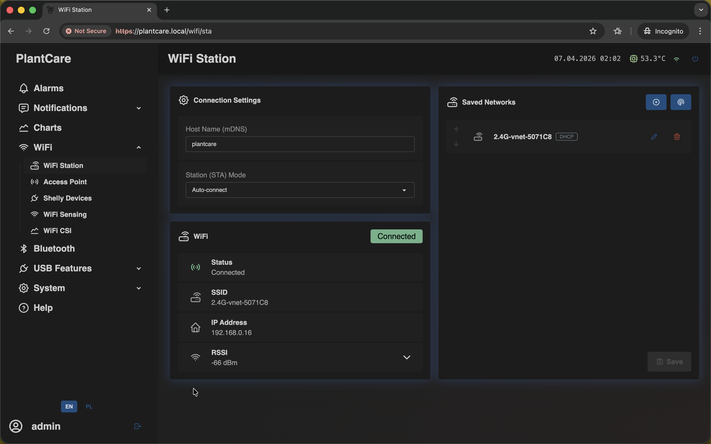
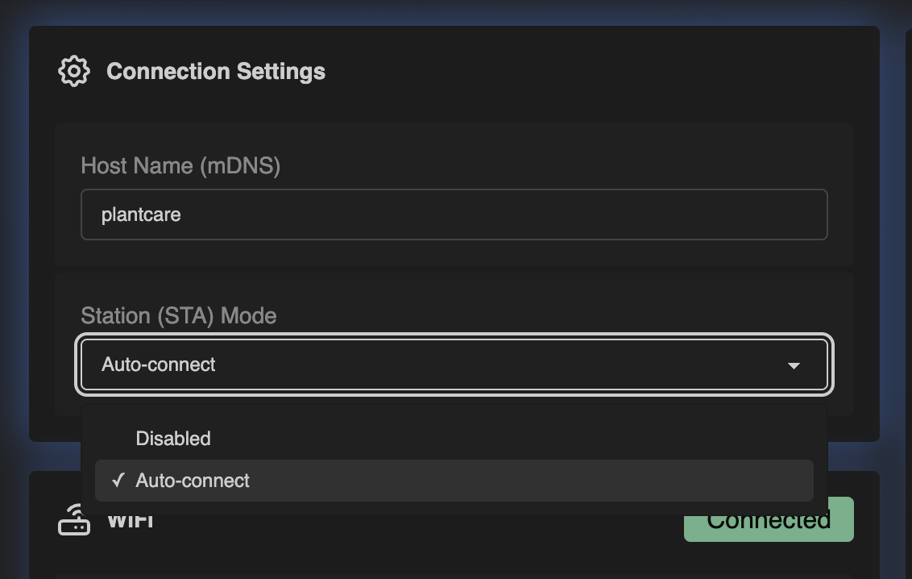
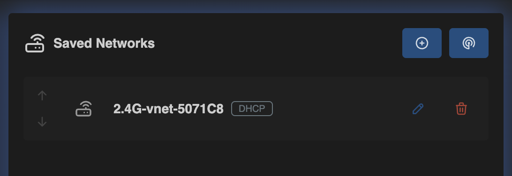
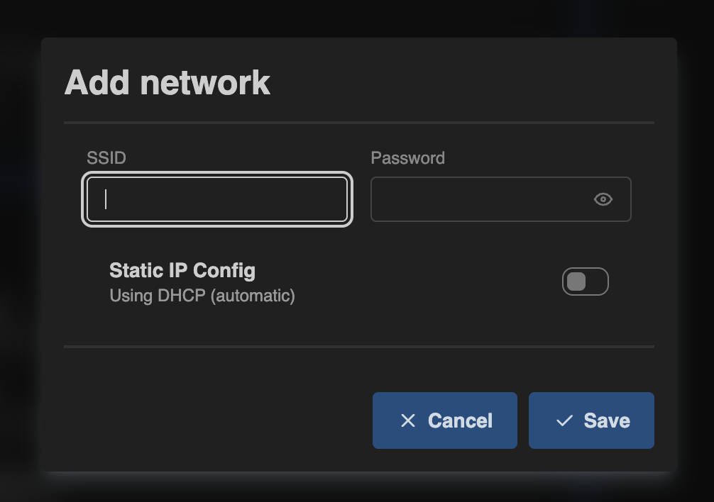
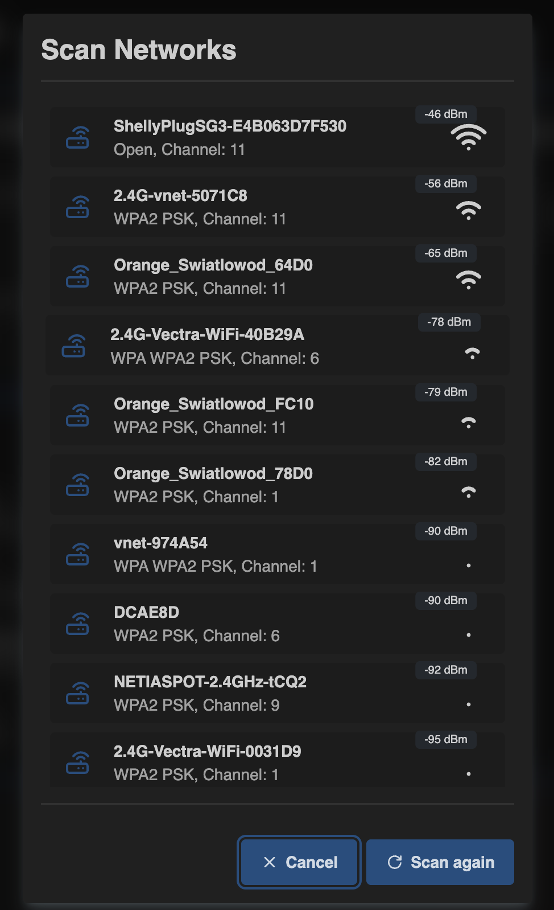
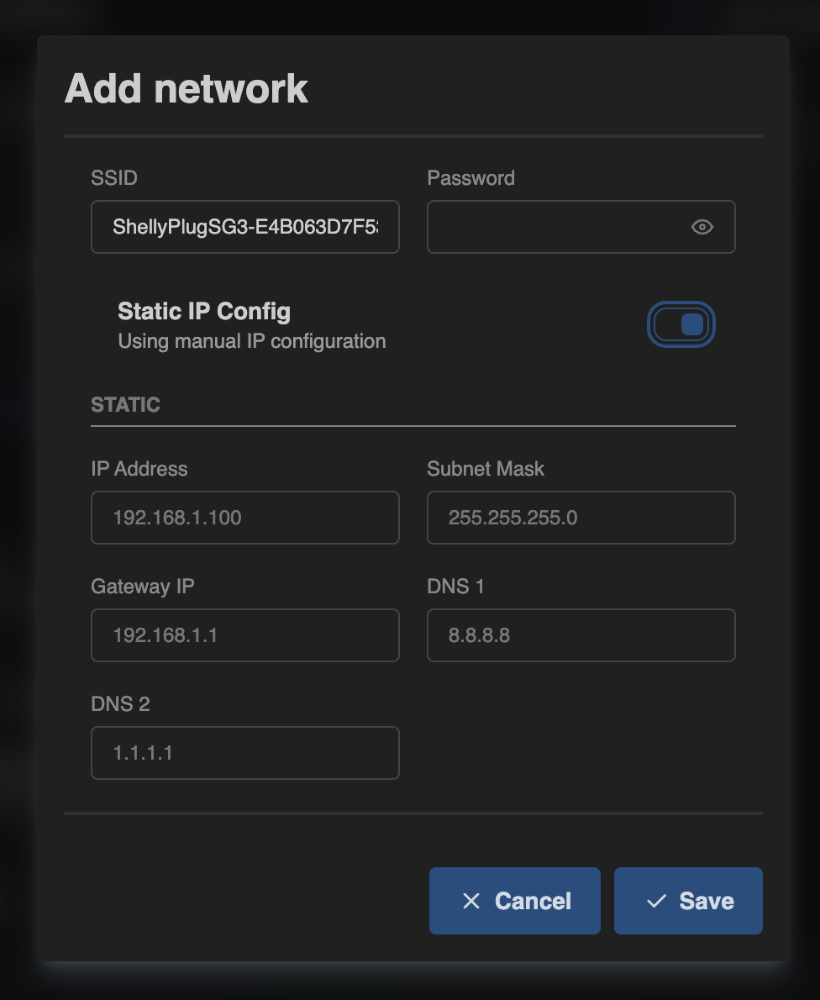

# Get Online and Connect to Home Wi-Fi

Navigation: [Home](../../README.md) · [Basic Flows](../../README.md#basic-use-cases) · [Additional Flows](../../README.md#additional-use-cases) · [Reference](../../README.md#reference-sections)

Use this flow to reach the device for the first time and move it from local
Access Point mode to your normal home network.

## Goal

- access the web interface
- save a working home Wi-Fi network
- confirm that the device is reachable after setup

## Recommended Steps

1. Power the device and wait for it to boot.
2. Connect your phone or computer to the fallback Access Point SSID
   `matrixhub.local`.
3. Open `https://matrixhub.local` or `https://192.168.4.1`.
4. If the current build or user setup requires authentication, sign in.
5. Open the `WiFi Station` page.

6. Check the connection settings. In most cases, keep:
   - `Host Name (mDNS)` as `matrixhub`
   - `Station (STA) Mode` as `Auto-connect`

The field stores the short hostname itself. When local name resolution works,
the browser address becomes `matrixhub.local`.

7. In `Saved Networks`, choose one of these options:
   - use `+` to add a network manually
   - use the scan button to pick a nearby network from the list

8. If you add the network manually, enter the SSID and password, then save.

9. If you use scanning, pick the correct network and then confirm the password.

10. Leave `Static IP Config` disabled unless your network requires fixed IP
    settings.

11. Save the configuration.
12. Reconnect your phone or computer to your normal home Wi-Fi.
13. Open `https://matrixhub.local` again, or use the IP assigned by your router.
14. On the `WiFi Station` page, confirm that the device shows as connected and
    no longer uses the fallback `192.168.4.1` address.
15. Open `System Status` and confirm that the device is online, the Wi-Fi link
    looks healthy, and sensor updates are still arriving.

## What Happens If Wi-Fi Cannot Connect?

- if `Station (STA) Mode` is set to `Offline`, the device stops trying normal
  Wi-Fi and stays on the local fallback AP path
- if there are no saved networks, the device also stays on the local AP path
- if saved networks exist but none of them work, MatrixHub keeps retrying them
  automatically instead of failing only once
- during a longer outage, the device can expose a recovery AP while Station
  recovery still continues in the background
- while recovery is in progress, the matrix IP screen can show the AP fallback
  address or `No WiFi`

## Third Option: Check the Address on the Matrix Menu

If `matrixhub.local` does not resolve yet and you do not want to check your
router immediately, you can read the current address directly on the device.

1. Press and hold the physical `BOOT` button for about `2 seconds` to enter
   the matrix menu.
2. Use short presses to cycle through the screens until you reach the IP screen.
3. The IP screen shows the local mDNS name and the current IP address, for
   example `https://matrixhub.local` and `https://192.168.x.x`.
4. Press and hold `BOOT` again for about `2 seconds` to exit the menu.

Notes:

- when the device is connected to your normal Wi-Fi, the menu shows the current
  station IP address
- when the device is still in AP mode, the menu can show the fallback address
  such as `192.168.4.1`
- if there is no active Wi-Fi connection, the menu shows `No WiFi`

## Related Reference Sections

- [Overview and first access](../../sections/overview.md)
- [Wi-Fi configuration](../../sections/wifi.md)
- [System Status](../../sections/system/status.md)
- [Behavior and availability](../../appendix/behavior-and-availability.md)

Navigation: [Home](../../README.md) · [Basic Flows](../../README.md#basic-use-cases) · [Additional Flows](../../README.md#additional-use-cases) · [Reference](../../README.md#reference-sections)
