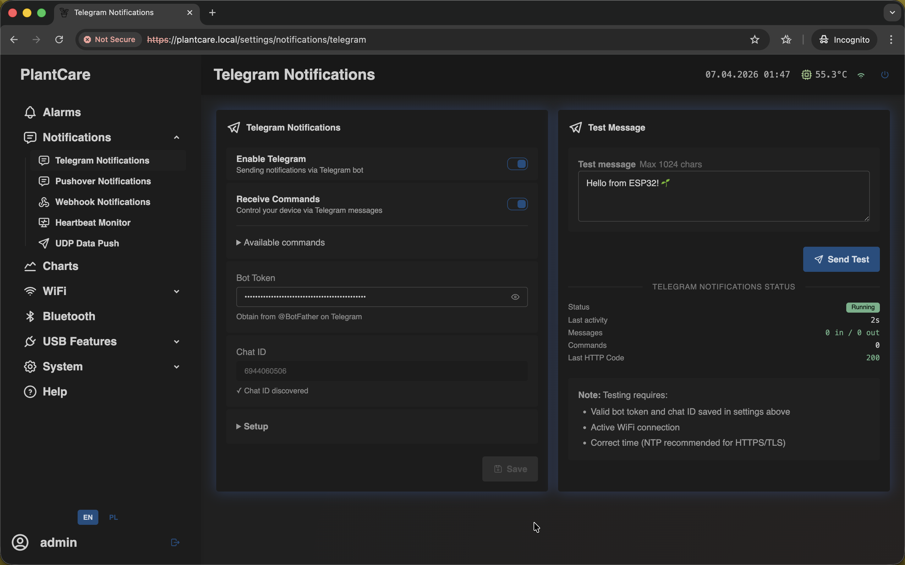
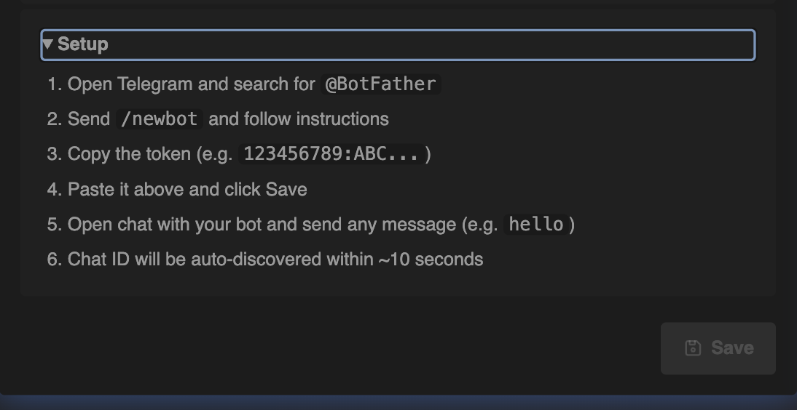
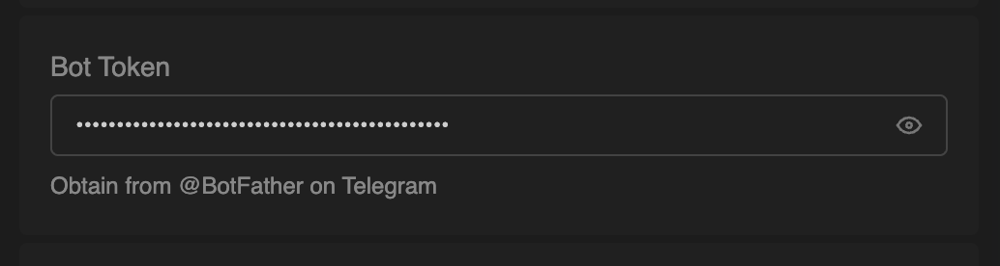
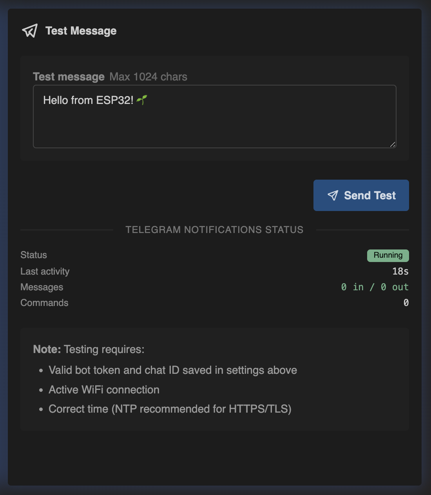

# Set Up Telegram Notifications

Navigation: [Home](../../README.md) · [Basic Flows](../../README.md#basic-use-cases) · [Additional Flows](../../README.md#additional-use-cases) · [Reference](../../README.md#reference-sections)

Use this flow to send the first remote test notification through Telegram.

## Video Demo

For a quick live example of an alarm being triggered and received in Telegram,
watch: [This Device Warns Me About High CO2 and Sends It to Telegram](https://youtu.be/uUkitUXndD8?si=6oeI0EoqvSQORf07)

## Before You Start

- the device should already have working Wi-Fi access
- you should have access to the `Telegram Notifications` page

Note:

- if you do not have a bot token yet, you can use the built-in `Setup` panel on
  the page

## Recommended Steps

1. Open `Notifications -> Telegram Notifications`.

2. If you still need a bot token, expand `Setup` and follow the checklist on
   the page.

3. Enable `Telegram Notifications`.
4. Paste the bot token.

5. Save the settings.
6. Open a chat with your bot in Telegram and send any message.
7. Wait for the page to auto-discover the `Chat ID`.
8. Use `Send Test` to verify delivery.

9. Confirm that the Telegram status is running before you rely on it for alarm
   delivery.
10. If you want chat-based control as well as alerts, enable `Receive Commands`.
11. Add `Telegram` as a channel in the alarm rule that should send remote
    alerts.

Important:

- selecting `Telegram` inside an alarm rule is not enough on its own
- the `Chat ID` field is auto-discovered and read-only on the page
- Telegram alarm delivery still depends on a valid token, a valid chat ID, and
  working Wi-Fi access
- if the test message does not work, the alarm will not be able to send through
  Telegram either

## Related Reference Sections

- [Notifications](../../sections/notifications.md)
- [Alarms](../../sections/alarms.md)

Navigation: [Home](../../README.md) · [Basic Flows](../../README.md#basic-use-cases) · [Additional Flows](../../README.md#additional-use-cases) · [Reference](../../README.md#reference-sections)
