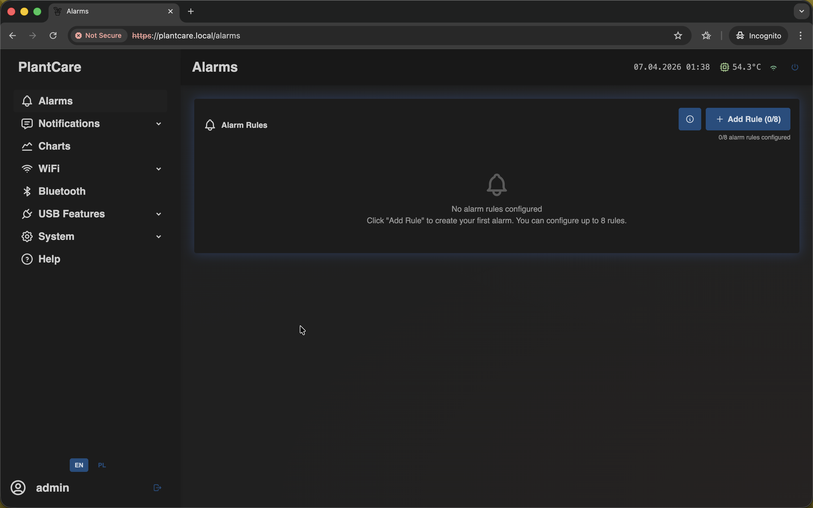
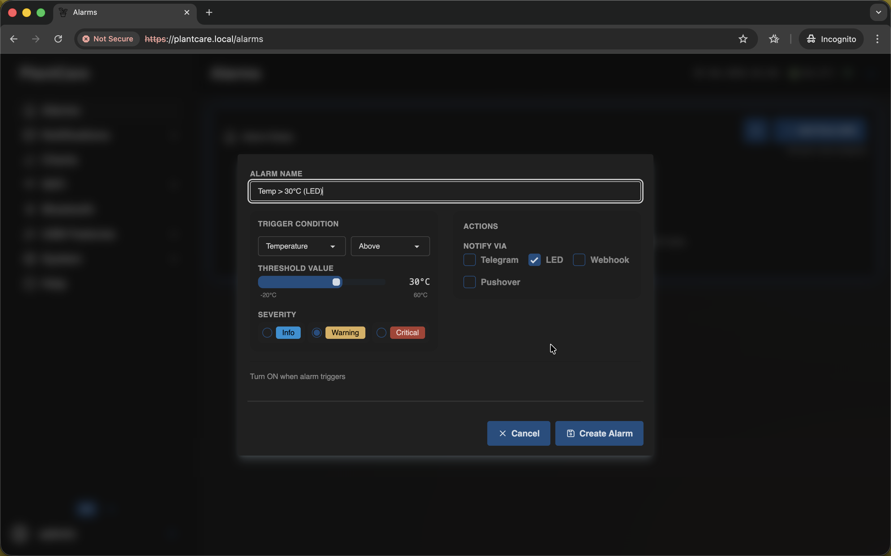
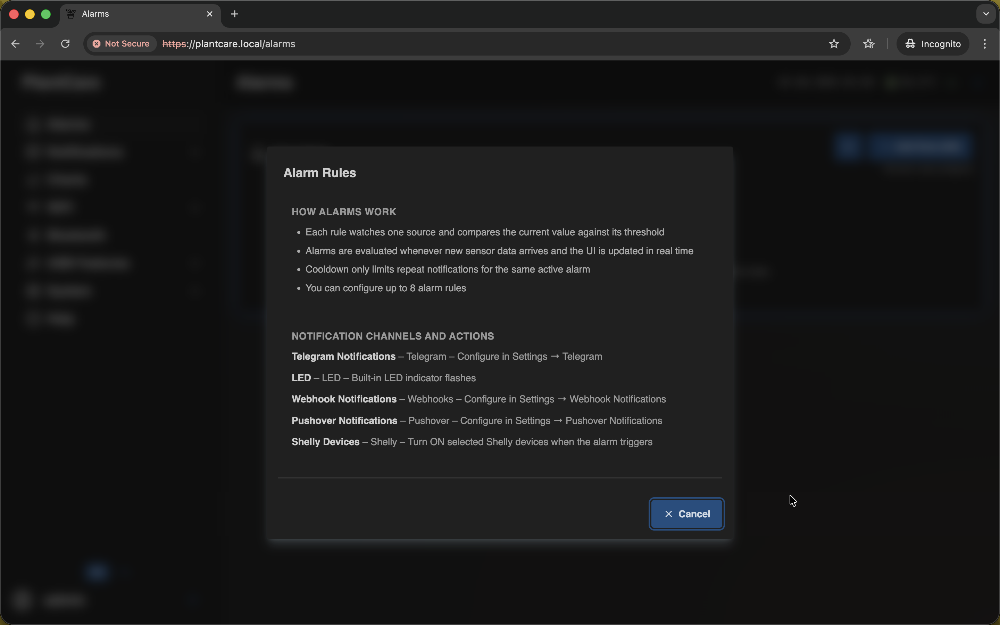

# Alarms

Navigation: [Home](../README.md) · [Basic Flows](../README.md#basic-use-cases) · [Additional Flows](../README.md#additional-use-cases) · [Reference](../README.md#reference-sections)

Use this page to create and manage threshold-based alarm rules.

For a full step-by-step walkthrough, see
[Add your first alarm rule](../flows/basic/add-first-alarm.md).

## Alarm Rules

The `Alarms` page is where you define threshold-based reactions for sensor
data. Each rule watches one source and compares the current value with the
configured condition.

If no rules are configured yet, use `Add Rule` to create the first one.

## Creating an Alarm

When adding a rule, define:

- alarm name
- trigger source
- comparison condition
- threshold value
- severity
- one or more actions

For local out-of-the-box behavior, `LED` is the simplest notification channel.

## Alarm Info and Channels

The alarm info modal explains how rules are evaluated and how the available
notification channels work.

Typical channels include:

- `LED` for local visual signaling
- `Telegram` for remote chat notifications
- `Webhook` for external systems
- `Pushover` for mobile push notifications
- optional Shelly actions when you want the rule to interact with selected
  relays

## Important Behavior

- `Enabled` means the rule is active and evaluated.
- `Triggered` means the current value crossed the configured threshold.
- `Notified` means MatrixHub decided it should send an output now.
- Saving, editing, or toggling one rule is currently applied as a full alarm
  snapshot, so other already-active rules can be re-armed and notify again.

These are related, but they are not the same thing.

Navigation: [Home](../README.md) · [Basic Flows](../README.md#basic-use-cases) · [Additional Flows](../README.md#additional-use-cases) · [Reference](../README.md#reference-sections)
