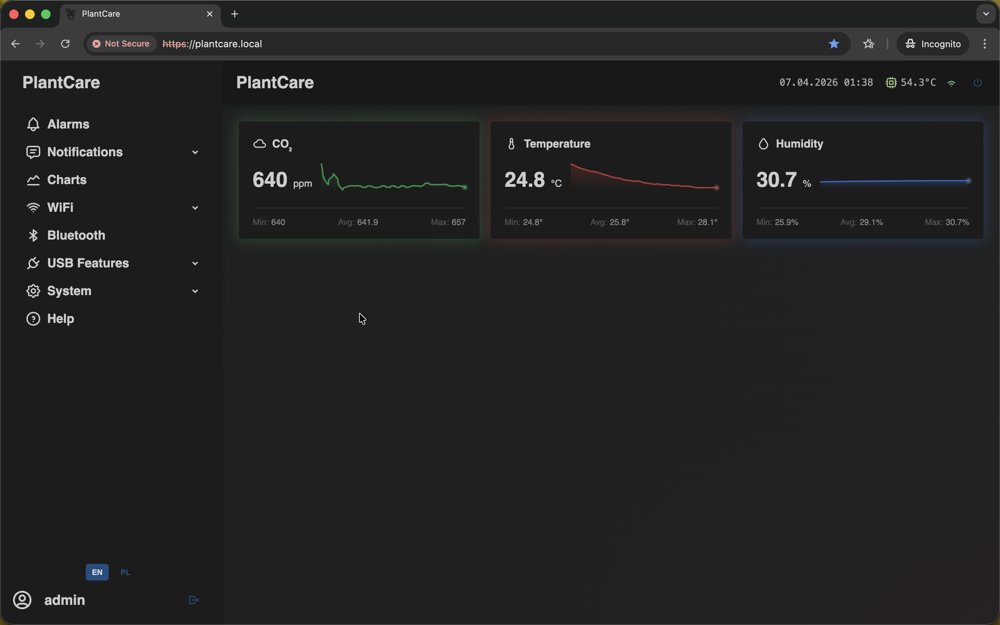
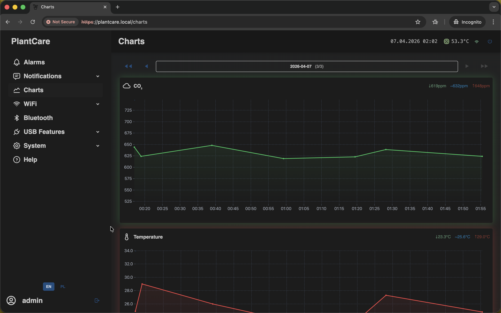
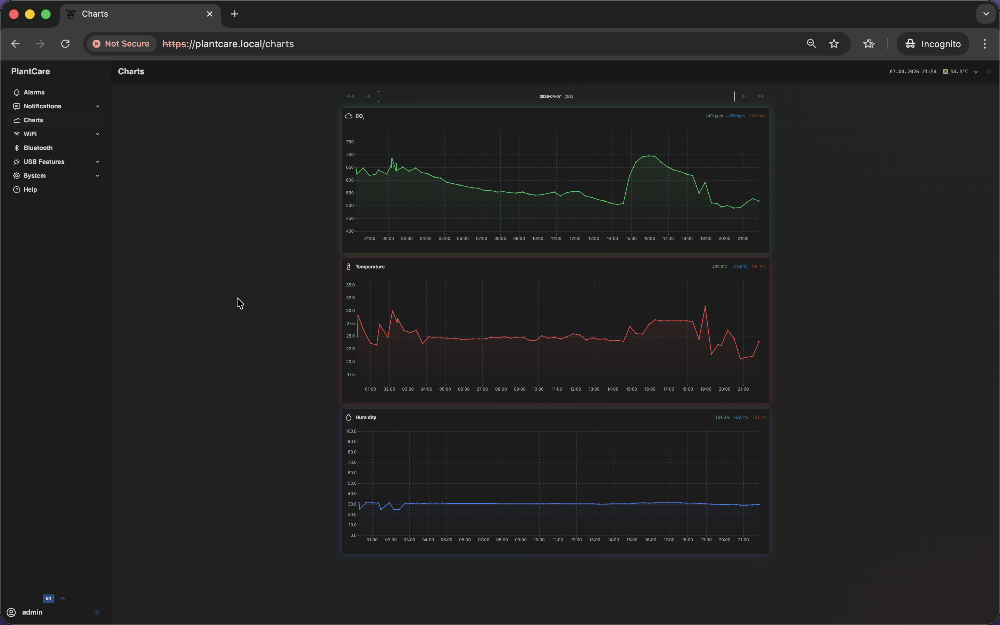
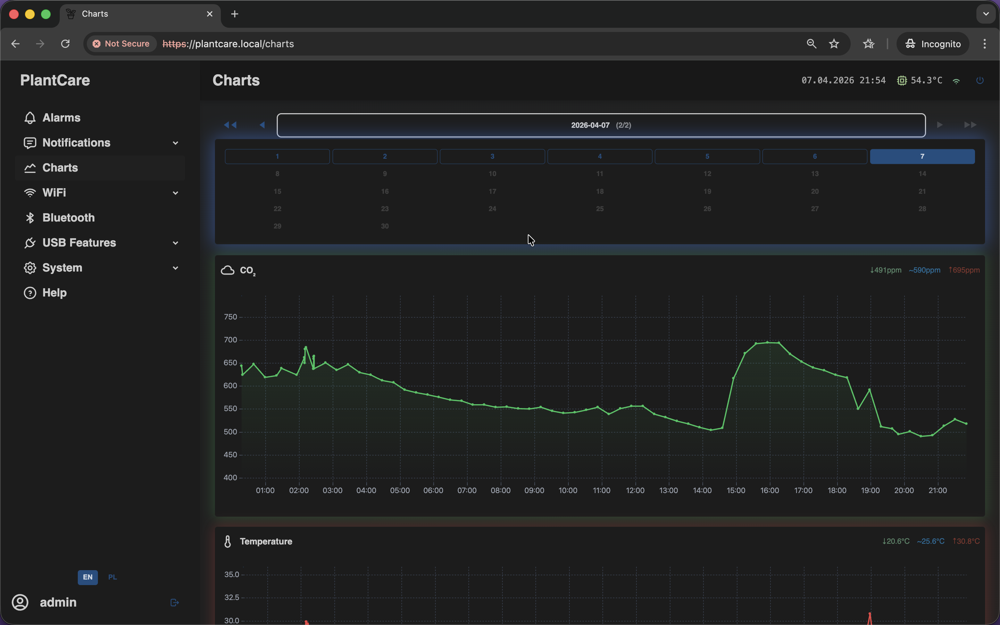
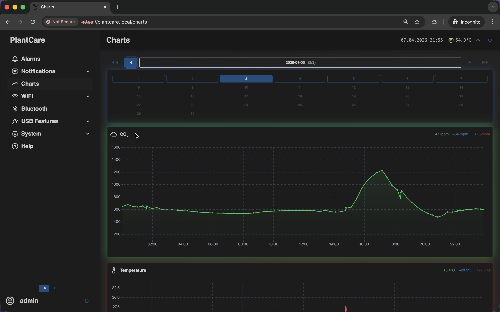
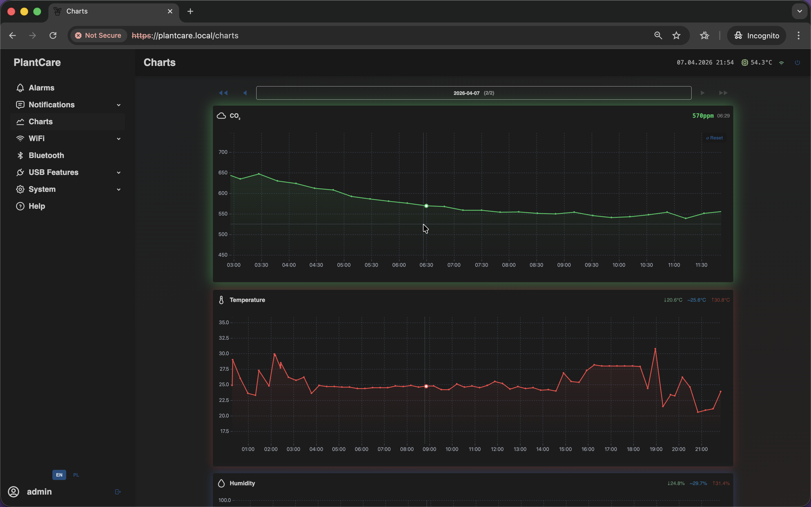

# Overview and First Access

Navigation: [Home](../README.md) · [Basic Flows](../README.md#basic-use-cases) · [Additional Flows](../README.md#additional-use-cases) · [Reference](../README.md#reference-sections)

Use this section to reach the device for the first time and understand the main
overview screens.

## Video Demo

If you want a quick interface walkthrough before reading page-by-page
reference notes, watch:
[MatrixHub Full Interface Tour: Alerts, Telegram, BLE, Shelly, and System Pages](https://youtu.be/ElIpB5tRcJQ)

## First Access

If the device has no saved Wi-Fi network, it starts in local Access Point mode.

Default first-access values:

- Access Point SSID: `matrixhub.local`
- Access Point address: `192.168.4.1`
- Default hostname: `matrixhub`
- Local mDNS address: `matrixhub.local`

The same `matrixhub.local` string can appear both as the local Wi-Fi network
name and as the browser address. The configured hostname itself is still the
short form `matrixhub`.

Typical first-run flow:

1. Power the device and wait for boot to complete.
2. Connect your computer or phone to the Access Point `matrixhub.local`.
3. Open `https://matrixhub.local` or `https://192.168.4.1` in a browser.
4. If the current build prompts for authentication, sign in.
5. Configure your regular Wi-Fi connection, alarms, and notifications.
6. Open `System Status` once the main setup is done so you can confirm that the
   device is online and updating normally.

If you want a quick reference for the authentication screen itself, see
[Login screen](../appendix/login.md).

For the predictable runtime rules behind Wi-Fi operating modes, reconnects, and
page availability, see
[Behavior and availability](../appendix/behavior-and-availability.md).

## Dashboard Overview

The dashboard is the main status page. It gives you a quick view of current
sensor readings and shows whether the device is online and updating data.

Use the dashboard to:

- verify that CO2, temperature, and humidity are updating
- confirm that the device is reachable
- quickly navigate to alarms, notifications, Wi-Fi, or system pages

Use `Dashboard` for quick sensor context and active alarms. Use
`System Status` when you need the deeper device-health view with Wi-Fi
diagnostics, task information, and admin live log tail.

## Charts

The `Charts` page helps you review recent sensor history instead of looking
only at the current values on the dashboard.

The page can also be used as a day-by-day history browser:

Use the day selector at the top to jump directly to another day in the current
month:

You can also move to older days and inspect historical threshold crossings in
more detail:

For a closer view of the active day, the charts page highlights the selected
point and shows the current reading near the graph header:

Use charts to:

- review CO2, temperature, and humidity trends over time
- move between saved days and compare different periods
- confirm that a threshold crossing was real and not a short spike
- compare current readings with earlier measurements

Navigation: [Home](../README.md) · [Basic Flows](../README.md#basic-use-cases) · [Additional Flows](../README.md#additional-use-cases) · [Reference](../README.md#reference-sections)
