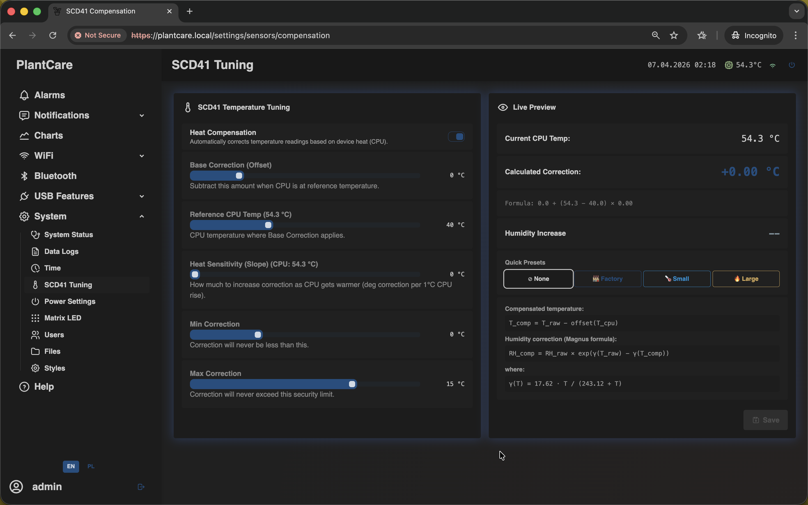

# Compensation / SCD41 Tuning

Navigation: [Home](../../README.md) · [Basic Flows](../../README.md#basic-use-cases) · [Additional Flows](../../README.md#additional-use-cases) · [Reference](../../README.md#reference-sections) · [System and maintenance](../system.md)

The `Compensation` page is an admin calibration screen for correcting stable
measurement offset caused by device heat or sensor placement.

Admin only: this is the same frontend screen used on the
`/settings/sensors/compensation` route.

Use it only when the offset is consistent over time. It is not meant for
one-off spikes or routine threshold tuning.

## Settings Card

The settings side controls:

- enable or disable compensation
- base temperature offset
- reference CPU temperature
- offset slope per CPU degree
- minimum and maximum clamp values

These controls change how the internal compensation model adjusts the reading.

## Live Preview

The preview side is what makes this page practical:

- it shows the current CPU temperature
- it calculates the correction that would be applied right now
- it shows whether the result is being clamped
- it estimates humidity impact
- it provides quick presets for common starting points

Use the preview before saving so you understand the effect of the new values.

## Important Behavior

- compensation changes the sensor reading model, not the alarm thresholds
- this page is for calibration, not for hiding short-term noise
- if the offset is not stable, review sensor placement first before adjusting
  compensation

## Related Pages

- [System Status](status.md)
- [Alarms](../alarms.md)

Navigation: [Home](../../README.md) · [Basic Flows](../../README.md#basic-use-cases) · [Additional Flows](../../README.md#additional-use-cases) · [Reference](../../README.md#reference-sections) · [System and maintenance](../system.md)
