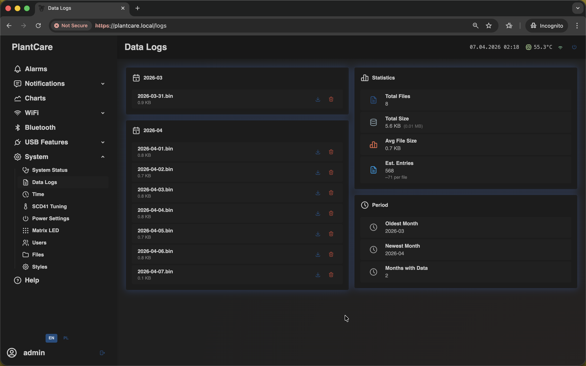

# Data Logs

Navigation: [Home](../../README.md) · [Basic Flows](../../README.md#basic-use-cases) · [Additional Flows](../../README.md#additional-use-cases) · [Reference](../../README.md#reference-sections) · [System and maintenance](../system.md)

The `Data Logs` page is the archive browser for stored sensor history.

This is the same frontend screen used on the `/logs` route.

Use it when you want to export older measurements, keep a copy outside the
device, or send a log file to support.

## Archive Browser

The main page groups files by month and shows one card per saved period.

From the archive area you can:

- browse month blocks
- find the date range you need
- download a file for local analysis

If management access is available, delete actions can also appear for archive
cleanup.

## Statistics and Period Summary

The right-side cards summarize:

- total file count
- total stored size
- average file size
- estimated entry count
- oldest and newest available month

This is useful when you want a quick sense of how much history is already saved
before you open individual files.

## Important Behavior

- the page can stay empty until the first archive is actually written
- downloading a file does not remove it from device storage
- deleting an archive is an administrative action
- `Data Logs` is for export and retention, while `Charts` is the faster page
  for quick visual comparison

## Related Pages

- [Download data logs](../../flows/additional/download-data-logs.md)
- [System Status](status.md)

Navigation: [Home](../../README.md) · [Basic Flows](../../README.md#basic-use-cases) · [Additional Flows](../../README.md#additional-use-cases) · [Reference](../../README.md#reference-sections) · [System and maintenance](../system.md)
