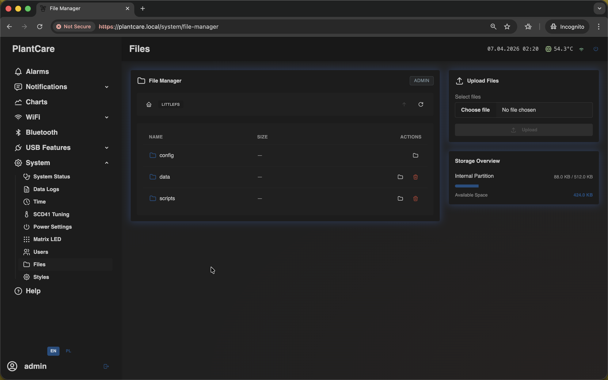
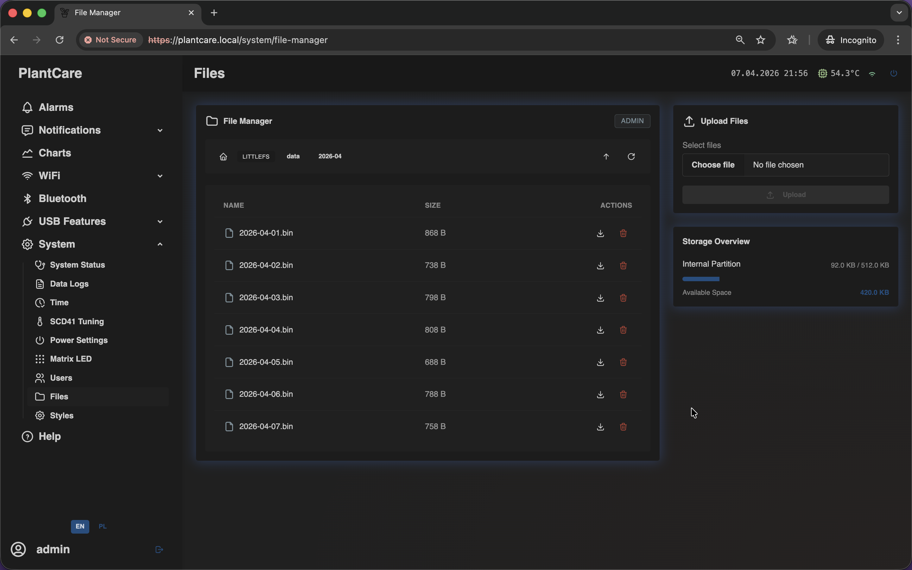

# File Manager

Navigation: [Home](../../README.md) · [Basic Flows](../../README.md#basic-use-cases) · [Additional Flows](../../README.md#additional-use-cases) · [Reference](../../README.md#reference-sections) · [System and maintenance](../system.md)

The `Files` menu entry opens the `File Manager` page for device storage.

This is the same frontend screen used on the `/system/file-manager` route.

This page is mainly for maintenance, support, and advanced workflows rather
than normal daily monitoring.

## Browser and Storage Overview

The main browser panel focuses on LittleFS storage and file actions.

When the feature is available and the session has management access, the page
lets you:

- browse directories
- move through breadcrumbs and parent folders
- refresh the current listing
- download entries
- delete removable entries
- upload files into the current directory
- check storage usage summary

## Protected and Disabled States

This page has two important limitations that are easy to miss:

- the feature can be disabled completely by firmware build settings
- protected config paths under `/config` are read-only in File Manager

When a path is read-only, downloads remain allowed, but uploads and deletions
are blocked.

## Important Behavior

- treat this page as a service tool, not as the normal way to work with logs
- `Data Logs` is the better page for sensor archive exports
- if the page only shows a disabled-state card, remote file browsing is not
  available on that build

## Related Pages

- [Data Logs](data-logs.md)
- [System Status](status.md)

Navigation: [Home](../../README.md) · [Basic Flows](../../README.md#basic-use-cases) · [Additional Flows](../../README.md#additional-use-cases) · [Reference](../../README.md#reference-sections) · [System and maintenance](../system.md)
