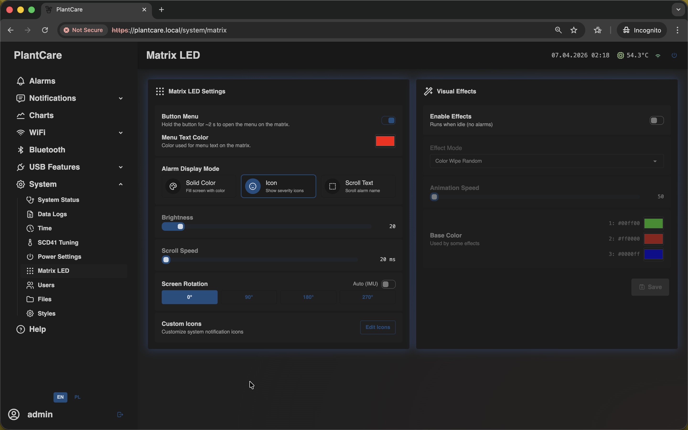
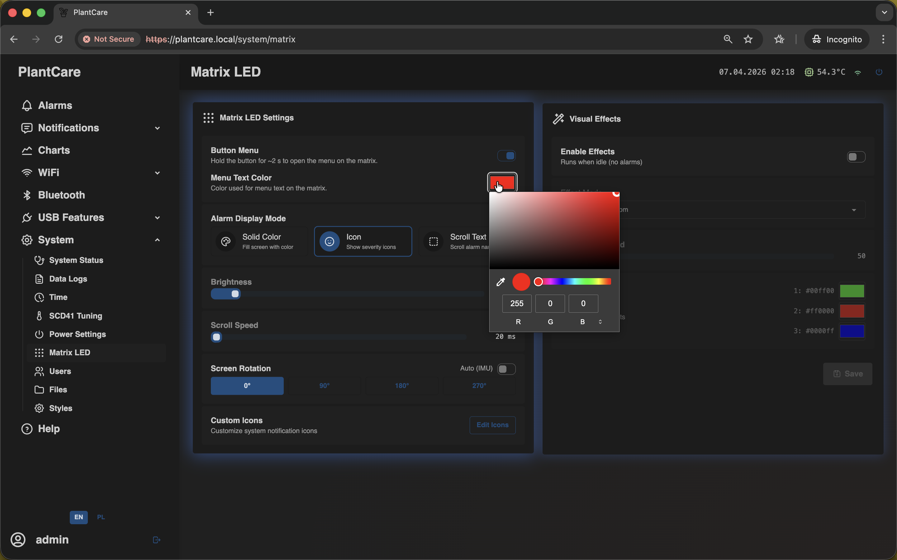
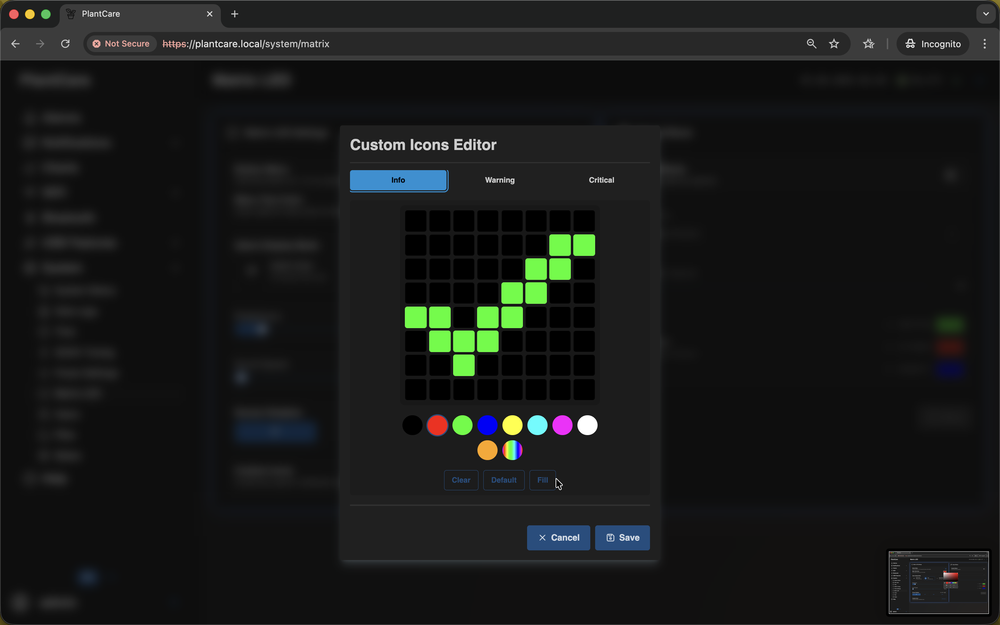
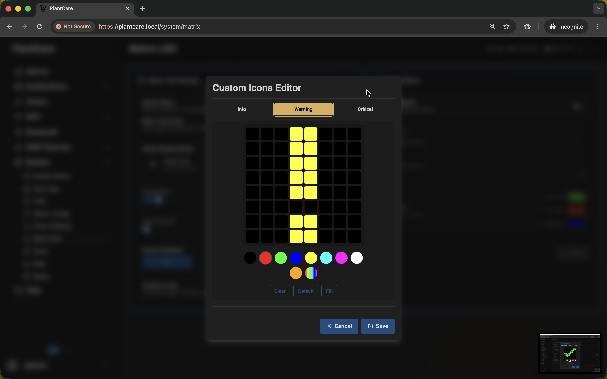
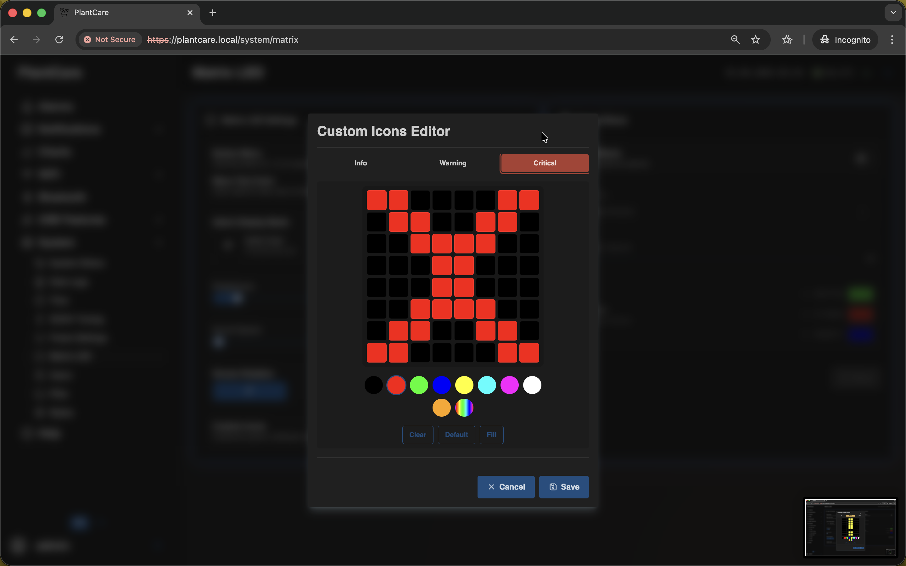
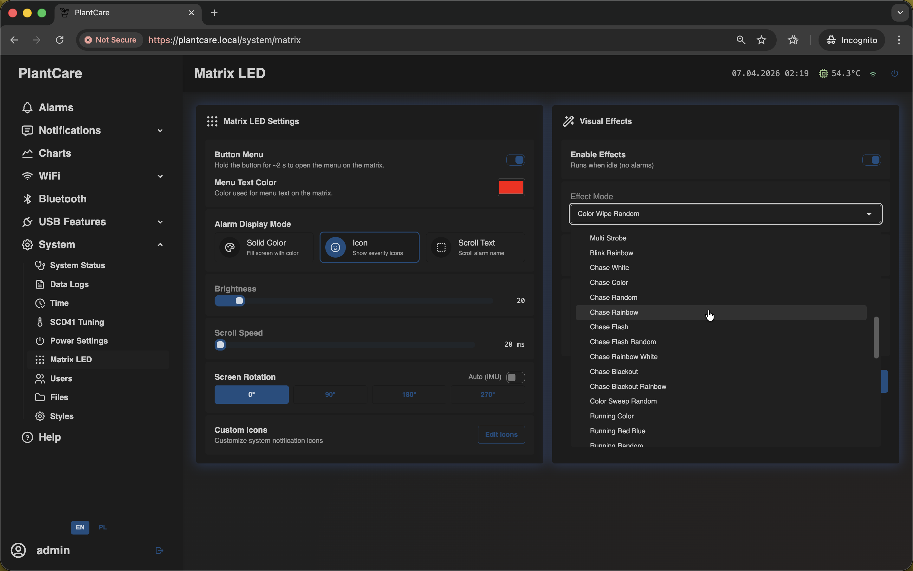

# Matrix LED

Navigation: [Home](../../README.md) · [Basic Flows](../../README.md#basic-use-cases) · [Additional Flows](../../README.md#additional-use-cases) · [Reference](../../README.md#reference-sections) · [System and maintenance](../system.md)

The `Matrix LED` page controls how the physical matrix display behaves on the
device.

This is the same frontend screen used on the `/system/matrix` route.

Users with read access can inspect current matrix settings. Management access
is required to change them.

## Main Display Settings

The settings card covers:

- menu enabled or disabled
- menu text color
- alarm display mode
- brightness
- scroll speed
- rotation and auto-rotate behavior

Menu text color is adjusted directly from the page:

Alarm display mode decides how active alarms appear on the matrix. This is the
most important setting when you want the device itself to communicate status
without opening the web UI.

## Custom Severity Icons

The page can also open an icon editor for severity-specific alarm symbols.

Use custom icons when you want the matrix to show a clearer visual distinction
between informational, warning, and critical alarms.

## Idle Effects

The separate effects card controls idle animation behavior:

- master effect enable switch
- effect mode
- effect speed
- up to three effect colors

These effects shape how the device looks when it is not actively showing menu
or alarm content.

## Important Behavior

- `Matrix LED` affects the device display, not the browser theme
- the page is useful both for readability and for making alerts more obvious
  from across a room
- the current settings stay inspectable even when the session cannot manage
  hardware settings

## Related Pages

- [Alarms](../alarms.md)
- [Customize Matrix LED alerts](../../flows/additional/customize-matrix-led.md)
- [Styles](styles.md)

Navigation: [Home](../../README.md) · [Basic Flows](../../README.md#basic-use-cases) · [Additional Flows](../../README.md#additional-use-cases) · [Reference](../../README.md#reference-sections) · [System and maintenance](../system.md)
