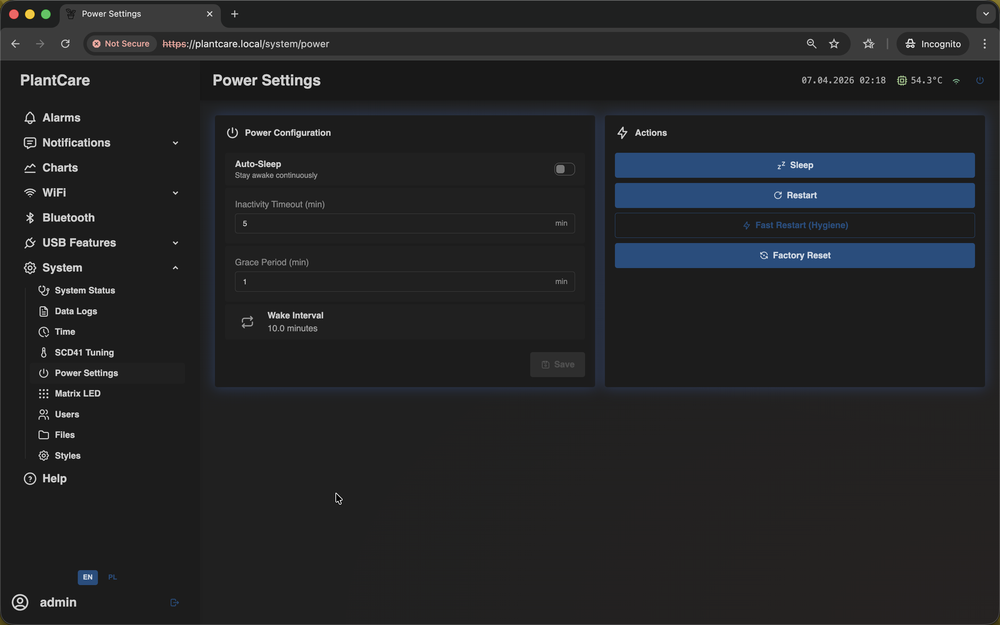

# Power Settings

Navigation: [Home](../../README.md) · [Basic Flows](../../README.md#basic-use-cases) · [Additional Flows](../../README.md#additional-use-cases) · [Reference](../../README.md#reference-sections) · [System and maintenance](../system.md)

The `Power Settings` page combines sleep behavior with maintenance and reset
actions.

Admin only: this is the same frontend screen used on the `/system/power`
route.

## Power Configuration

The configuration card controls:

- `Auto-Sleep`
- inactivity timeout
- grace period after boot
- current wake interval
- sleep ETA when a sleep request is already pending

Use this side when you want MatrixHub to stay awake continuously or go to sleep
after a defined period of inactivity.

## Actions

The actions card is for deliberate maintenance actions:

- `Sleep` enters the sleep cycle on builds where the sleep feature is enabled
- `Restart` performs a normal reboot
- `Fast Restart (Hygiene)` is a maintenance-oriented quick restart path
- `Factory Reset` clears saved configuration and returns the device to the
  first-access network path

## Important Behavior

- `Factory Reset` removes saved Wi-Fi configuration, LittleFS data, and app
  preferences
- after factory reset, the fallback AP path becomes the normal way back into
  the device
- `Sleep` and `Auto-Sleep` are related, but they are not the same thing:
  `Auto-Sleep` is policy, while `Sleep` is an immediate action
- the `Sleep` action itself may be absent on builds where sleep support is not
  enabled

## Related Pages

- [System Status](status.md)
- [Time](time.md)

Navigation: [Home](../../README.md) · [Basic Flows](../../README.md#basic-use-cases) · [Additional Flows](../../README.md#additional-use-cases) · [Reference](../../README.md#reference-sections) · [System and maintenance](../system.md)
