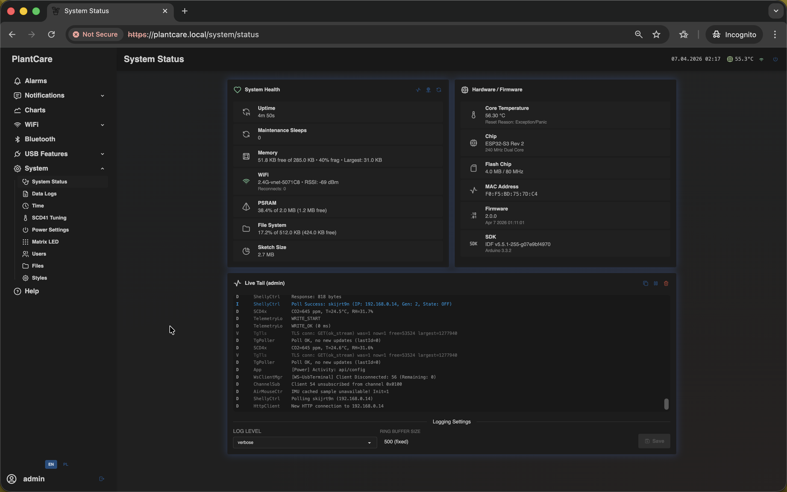
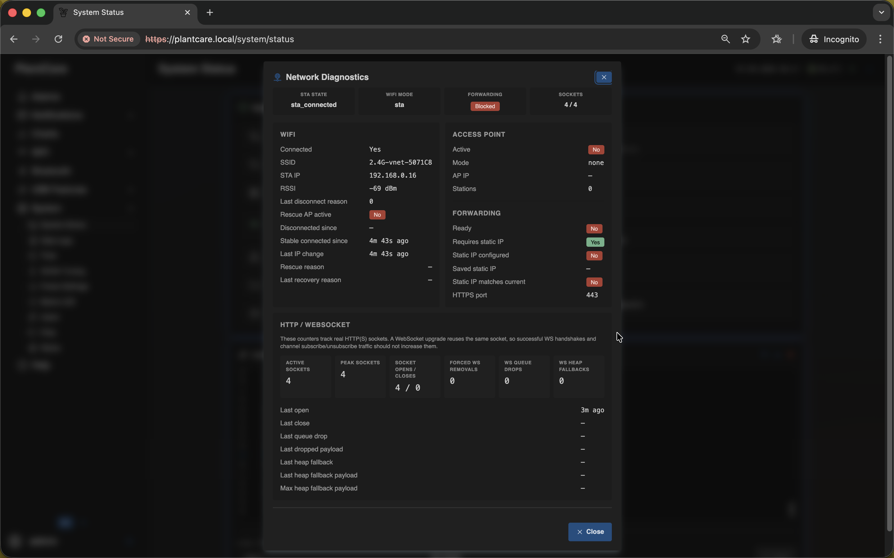
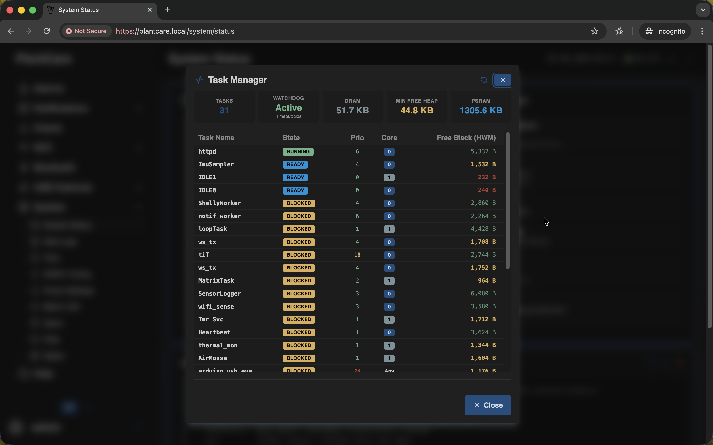

# System Status

Navigation: [Home](../../README.md) · [Basic Flows](../../README.md#basic-use-cases) · [Additional Flows](../../README.md#additional-use-cases) · [Reference](../../README.md#reference-sections) · [System and maintenance](../system.md)

The `System Status` page is the main health and diagnostics screen for the live
device.

This is the same frontend screen used on the `/system/status` route.

Use it when you want to confirm that MatrixHub is online, updating, and not
quietly drifting into a recovery or degraded state.

## Health Overview

The main health card combines several quick checks in one place:

- uptime
- maintenance sleep count
- memory usage and fragmentation context
- Wi-Fi state, RSSI, reconnect count, and AP-mode badge
- storage usage for file system, PSRAM, LP SRAM, and sketch space

If Wi-Fi is disconnected and the device is not already running through the AP
path, the Wi-Fi section can expose a manual `Reconnect` action. Use it as a
safe first recovery step before changing saved Wi-Fi settings.

## Hardware and Firmware

The hardware card helps you verify:

- core temperature
- last reset reason
- chip revision, CPU frequency, and core count
- flash size and speed
- MAC address
- firmware version, compile date, ESP-IDF version, and Arduino version

This is the fastest place to check whether you are looking at the expected
device and firmware build.

## Network Diagnostics

Open `Network Diagnostics` when the normal Wi-Fi summary is not enough.

The modal shows:

- configured Wi-Fi mode and current radio mode
- current STA state and whether AP is active
- forwarding readiness and static-IP-related checks
- HTTP and WebSocket socket counters

Use it when MatrixHub is still reachable, but the network behavior looks
unstable or inconsistent.

## Task Manager

Open `Task Manager` for lower-level runtime inspection.

Use it to review:

- task count
- watchdog state and timeout
- free heap and PSRAM summary
- task state, priority, core placement, and free stack watermark

Treat it as a diagnostics and support tool rather than a daily monitoring view.

## Live Tail (Admin only)

Administrator sessions also get the `Live Tail` card below the main system
cards.

Use it when you want to:

- watch current log lines without downloading archives
- pause, copy, or clear the visible tail
- change the active live log level

`Live Tail` is for immediate debugging. `Data Logs` is for stored historical
export.

## Related Pages

- [Data Logs](data-logs.md)
- [Time](time.md)
- [Behavior and availability](../../appendix/behavior-and-availability.md)

Navigation: [Home](../../README.md) · [Basic Flows](../../README.md#basic-use-cases) · [Additional Flows](../../README.md#additional-use-cases) · [Reference](../../README.md#reference-sections) · [System and maintenance](../system.md)
