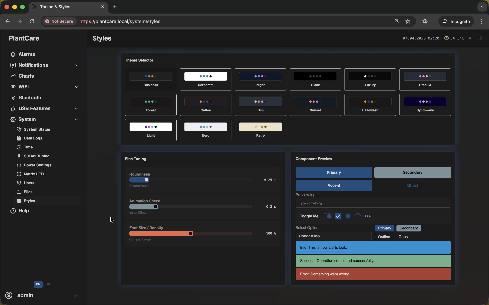

# Styles

Navigation: [Home](../../README.md) · [Basic Flows](../../README.md#basic-use-cases) · [Additional Flows](../../README.md#additional-use-cases) · [Reference](../../README.md#reference-sections) · [System and maintenance](../system.md)

The `Styles` page is the browser-side theme and appearance editor for the web
interface.

This is the same frontend screen used on the `/system/styles` route. The card
title on the page appears as `Theme Selector`.

## What You Can Change

The page lets you adjust:

- the active visual theme
- border radius
- animation speed
- font size
- a live preview of common UI elements

Use it when you want the dashboard to feel more compact, more readable, or
more visually comfortable on your current browser.

## Important Behavior

- `Styles` is local to the current browser profile and device
- the settings are stored in browser `localStorage`
- these changes are not written into MatrixHub firmware settings
- other users and other browsers keep their own appearance settings
- this page does not control the physical `Matrix LED` display on the device

`Styles` is therefore best understood as a personal dashboard preference page,
not a shared system configuration screen.

## Related Pages

- [Matrix LED](matrix-led.md)
- [Help page](../../appendix/help.md)

Navigation: [Home](../../README.md) · [Basic Flows](../../README.md#basic-use-cases) · [Additional Flows](../../README.md#additional-use-cases) · [Reference](../../README.md#reference-sections) · [System and maintenance](../system.md)
