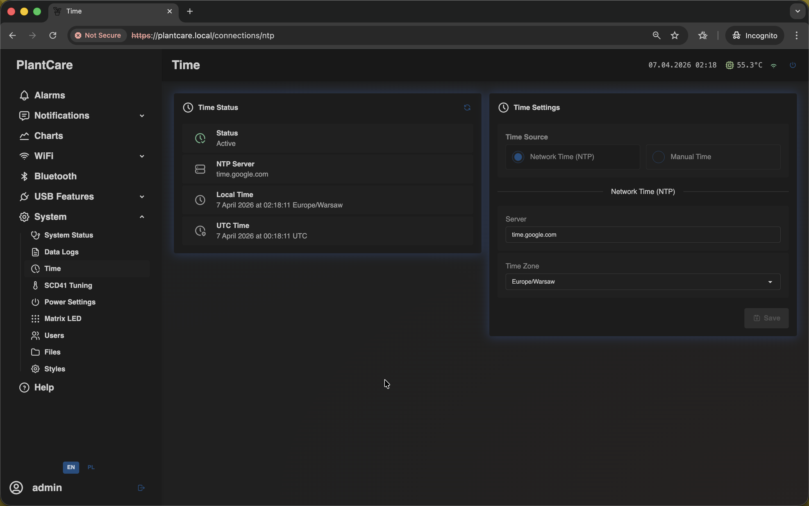

# Time

Navigation: [Home](../../README.md) · [Basic Flows](../../README.md#basic-use-cases) · [Additional Flows](../../README.md#additional-use-cases) · [Reference](../../README.md#reference-sections) · [System and maintenance](../system.md)

The `Time` page controls how MatrixHub knows the current date and time.

This is the same frontend screen used on the `/connections/ntp` route.

Accurate time matters for logs, charts, timestamps, and network services that
depend on valid clock state.

## Time Status

The left status card shows:

- whether time sync is active
- the current NTP server
- the current local time
- the current UTC time

Read-only users can still use this side of the page as a status view even when
they cannot edit the settings card.

## Time Source and Settings

The settings card offers two practical modes:

- `Network Time (NTP)` when you want MatrixHub to keep its clock synchronized
  automatically
- `Manual Time` when you need to set the clock yourself

In `Network Time (NTP)` mode, the page lets you:

- enter the NTP server
- choose the time zone
- save the settings for normal automatic sync

In `Manual Time` mode, the page lets you:

- type a specific date and time
- use the current browser time as a quick fill action
- apply the entered value on save

## Important Behavior

- the status card shows both local and UTC time, so time-zone mistakes are
  easier to spot
- manual time is useful during setup, recovery, or isolated networks without
  external NTP access
- normal long-term use is usually easiest in `Network Time (NTP)` mode
- on builds where the NTP feature is disabled, the live page can be unavailable
  even though the docs keep the route documented conceptually

## Related Pages

- [System Status](status.md)
- [Data Logs](data-logs.md)

Navigation: [Home](../../README.md) · [Basic Flows](../../README.md#basic-use-cases) · [Additional Flows](../../README.md#additional-use-cases) · [Reference](../../README.md#reference-sections) · [System and maintenance](../system.md)
