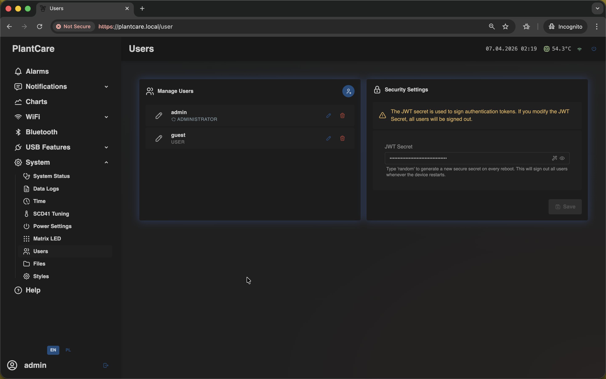

# Users

Navigation: [Home](../../README.md) · [Basic Flows](../../README.md#basic-use-cases) · [Additional Flows](../../README.md#additional-use-cases) · [Reference](../../README.md#reference-sections) · [System and maintenance](../system.md)

The `Users` page manages local accounts and authentication settings.

Admin only: this is the same frontend screen used on the `/user` route.

## User Management

The left side is the local-user list.

Use it to:

- add a new user
- edit an existing user
- delete a user
- choose whether that user has administrator rights

This page is relevant when MatrixHub should be shared between multiple people
or when you want a safer separation between read-only and management sessions.

## Security Settings

The right side focuses on the `JWT Secret`.

This value is used to sign authentication tokens for the web interface. It is
therefore more sensitive than an ordinary cosmetic setting.

## Important Behavior

- changing the `JWT Secret` signs out active sessions
- changing the current user's password or role can also invalidate the current
  session
- this page is separate from the `Login` screen: `Login` is where users sign
  in, while `Users` is where accounts and token-signing settings are managed

## Related Pages

- [Login screen](../../appendix/login.md)
- [System Status](status.md)

Navigation: [Home](../../README.md) · [Basic Flows](../../README.md#basic-use-cases) · [Additional Flows](../../README.md#additional-use-cases) · [Reference](../../README.md#reference-sections) · [System and maintenance](../system.md)
