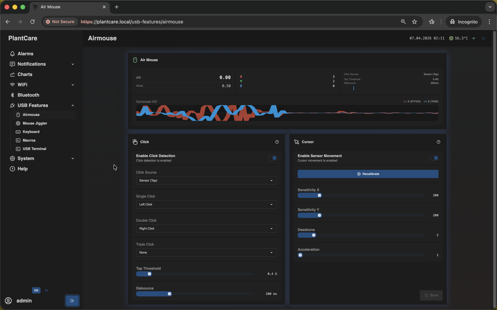
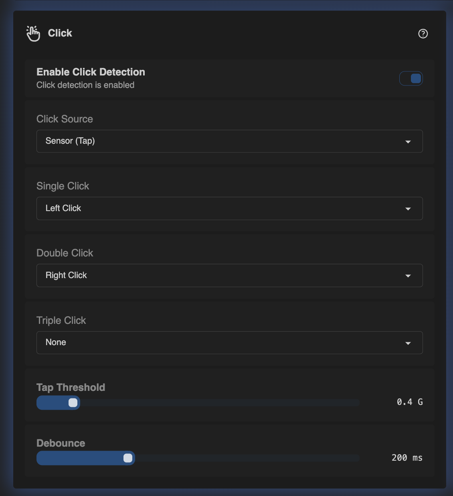
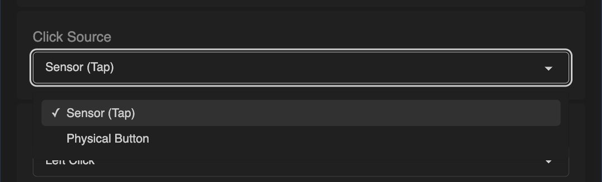
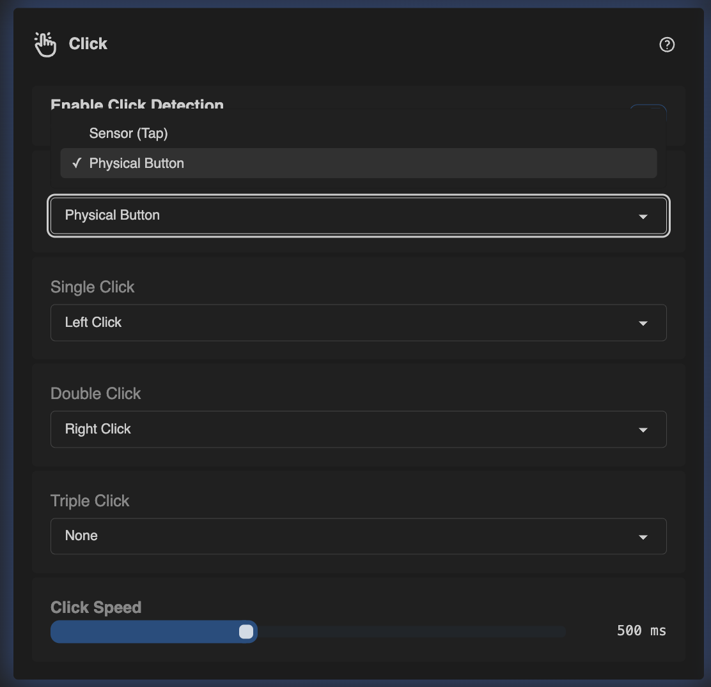
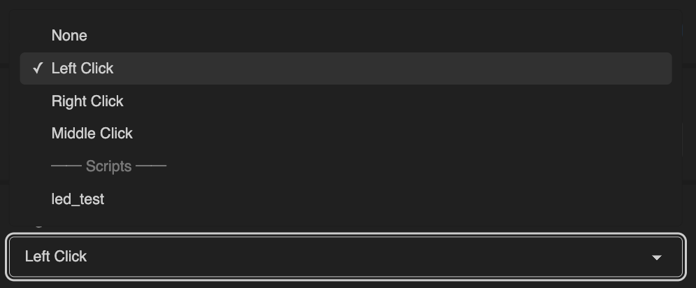
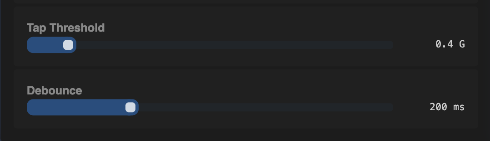
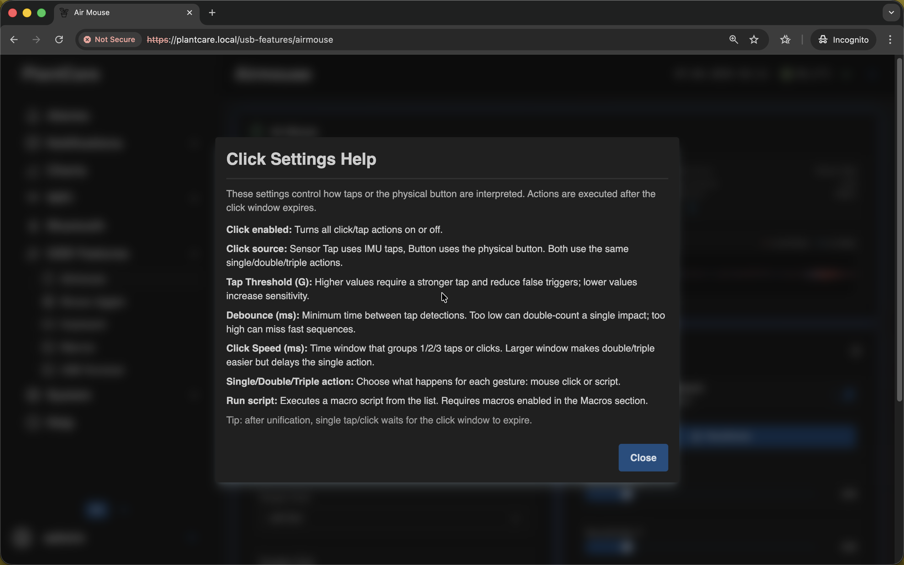
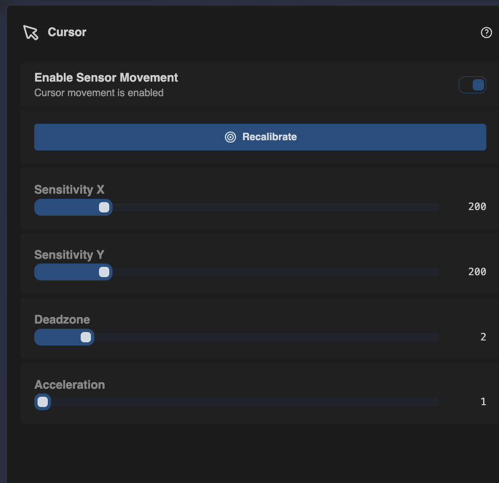
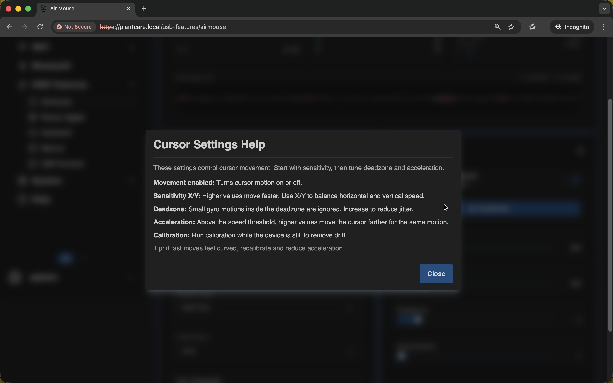

# Air Mouse

Navigation: [Home](../../README.md) · [Basic Flows](../../README.md#basic-use-cases) · [Additional Flows](../../README.md#additional-use-cases) · [Reference](../../README.md#reference-sections) · [USB Features](../usb-features.md)

The `Airmouse` page combines motion-based cursor control with configurable tap
or click actions.

Admin only: this page is available only to users with management access on
current builds.

The page combines three useful views at once:

- a live sensor strip at the top with tap and motion feedback
- the `Click` block on the left
- the `Cursor` block on the right

That top strip is helpful while tuning the feature because you can watch the
device react before saving changes. `AG`, `PEAK`, and the gyro traces make it
easier to tell whether taps are being detected too easily or whether movement
is still too noisy.

## Click Settings

The `Click` block lets you enable click detection, choose the click source, and
map single, double, and triple click actions.

What the main settings do:

- `Enable Click Detection` turns all tap or button-triggered actions on or off
- `Click Source` decides whether clicks come from `Sensor (Tap)` or the
  `Physical Button`
- `Single Click`, `Double Click`, and `Triple Click` define what happens for
  each gesture

Both click sources use the same action mapping. The difference is only how the
gesture is detected.

The click source can use either sensor taps or the physical device button:

- `Sensor (Tap)` interprets physical taps detected by the IMU
- `Physical Button` uses the hardware button instead of tap detection

In both modes, actions are executed after the click window expires. That means
a single tap or single button press waits briefly to make sure it is not part
of a double or triple click sequence.

Each click action can trigger a normal mouse button or a saved script:

You can assign:

- standard mouse actions such as `Left Click`, `Right Click`, or `Middle Click`
- a saved macro script from the `Scripts` section in the dropdown

This is where the Air Mouse links to `USB Features -> Macros`.

Example:

- if `Click Source` is `Sensor (Tap)` and `Single Click` is set to a saved
  macro, one tap runs that script
- if `Click Source` is `Physical Button` and `Single Click` is set to the same
  macro, one button press runs that script instead

So the script is not tied to the sensor or button directly. It is tied to the
selected `Single/Double/Triple Click` action, and the `Click Source` decides
which input produces that gesture.

When `Sensor (Tap)` is selected, the bottom sliders tune tap detection:

- `Tap Threshold` controls how strong a tap must be
- higher values reduce accidental triggers
- lower values make tap detection more sensitive
- `Debounce` sets the minimum time between detected taps
- if debounce is too low, one impact can be counted twice
- if debounce is too high, fast double or triple tap sequences become harder to
  detect

A practical way to tune these values is to start with the default range,
perform a few normal taps, and then change only one slider at a time. That
makes it much easier to understand which setting is actually improving the
result.

When `Physical Button` is selected, the tap sliders are replaced by `Click Speed`.
This is the timing window used to group one, two, or three button presses into
single, double, or triple click actions. A larger window makes multi-clicks
easier, but also delays the single-click action a little longer.

The built-in help explains how click interpretation works:

If you map a click action to a script, that script must also exist in
`USB Features -> Macros`, and macros must be enabled there as well.

## Cursor Settings

The `Cursor` block controls sensor-based movement.

Use it to:

- enable or disable sensor movement
- recalibrate the neutral position
- tune X/Y sensitivity
- adjust deadzone and acceleration

What the cursor settings do:

- `Enable Sensor Movement` turns cursor motion on or off
- `Recalibrate` should be used while the device is still, so drift can be
  reduced
- `Sensitivity X` and `Sensitivity Y` control horizontal and vertical cursor
  speed
- `Deadzone` ignores very small motion so the cursor does not jitter
- `Acceleration` increases movement during faster gestures

Practical tuning order:

1. Start with calibration.
2. Adjust `Sensitivity X` and `Sensitivity Y`.
3. Increase `Deadzone` if the cursor drifts or jitters.
4. Raise `Acceleration` only if larger movements still feel too short.

Cursor tuning also has a dedicated help modal for sensitivity, deadzone,
acceleration, and recalibration:

## Best Use Cases

Air Mouse works especially well when you want MatrixHub to act as an emergency
USB pointing device from the web UI.

Examples:

- use it as a fallback mouse when the target host is connected over USB but you
  do not have a spare mouse nearby
- combine it with the `Keyboard` page as an emergency input pair for a fresh
  system, maintenance station, or kiosk PC
- bind one click action to a saved macro so one tap or button press can launch
  a repeatable host action
- keep simple pointer control available without switching away from the MatrixHub
  web interface

Navigation: [Home](../../README.md) · [Basic Flows](../../README.md#basic-use-cases) · [Additional Flows](../../README.md#additional-use-cases) · [Reference](../../README.md#reference-sections) · [USB Features](../usb-features.md)
