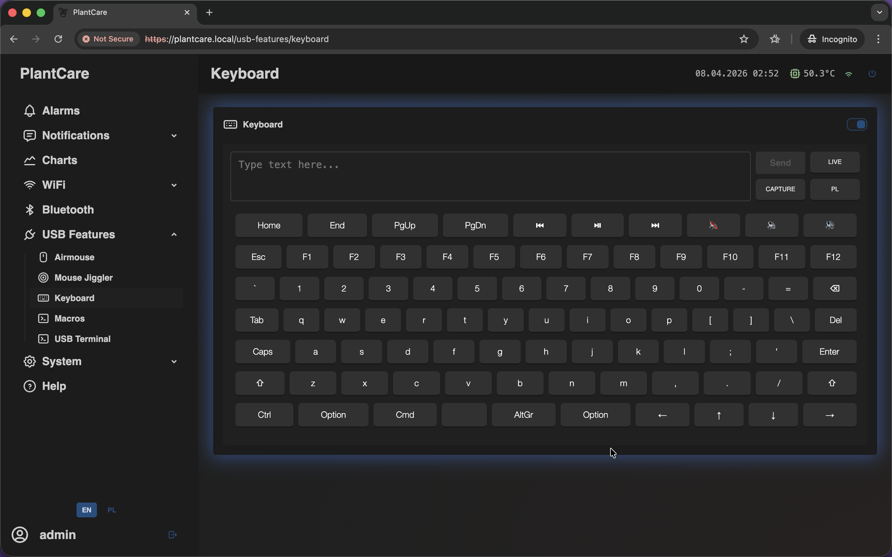
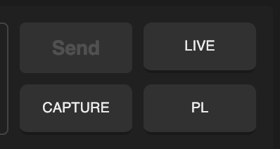
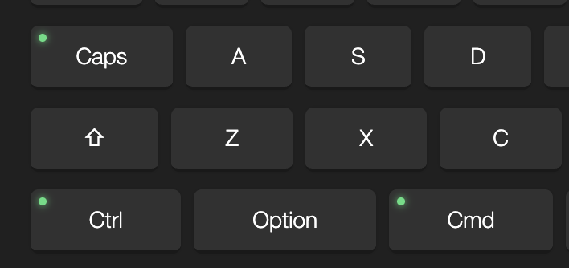

# Keyboard

Navigation: [Home](../../README.md) · [Basic Flows](../../README.md#basic-use-cases) · [Additional Flows](../../README.md#additional-use-cases) · [Reference](../../README.md#reference-sections) · [USB Features](../usb-features.md)

The `Keyboard` page provides an on-screen keyboard for sending text and common
keys through the USB keyboard interface. Current builds also include a local
`Capture` mode that mirrors physical key presses inside the page.

Admin only: this page is available only to users with management access on
current builds.

## Main Controls

The page includes:

- a text box for queued input
- a `Send` button
- a `Live` toggle
- a `Capture` toggle
- a layout switcher
- the interactive on-screen key panel

The top text box is best for sending short words, commands, or credentials as
one batch. The lower on-screen keyboard is better when you need direct access
to function keys, arrows, media keys, or modifiers from the browser.

The control area groups `Send`, `Live`, `Capture`, and the layout switcher in
a compact block next to the input area.

## Important Behavior

- `Enable Keyboard` is controlled from the page header
- turning the keyboard feature on or off is saved with restart confirmation
- `Send` submits the queued text to the host and confirms with `Enter`
- `Live` sends normal characters immediately as you type or tap keys
- `Capture` listens to the physical keyboard in the browser and highlights the
  matching keys on the on-screen layout
- while `Capture` is active, the queued text box is disabled so monitoring and
  typed input do not conflict
- if the page loses focus, tracked key highlights are cleared automatically
- the layout button cycles through `PL`, `EN`, and `RU`

`Send` is the safer default when you want to review text before transmitting
it. `Live` is better for quick tests, single characters, and situations where
the host should react immediately to each key press. `Capture` is different:
it is a browser-side monitoring aid for the on-screen keyboard rather than a
separate send mode.

Modifier keys can also stay active long enough to build shortcuts:

This is especially useful when you need combinations such as `Ctrl` plus a
letter, navigation key, or system shortcut from the browser.

This is useful for:

- quick text entry
- special keys and shortcuts
- checking how a physical keyboard maps onto the on-screen layout
- simple remote keyboard control from the web interface

## Best Use Cases

Examples:

- use it as an emergency USB keyboard when the target machine is connected but
  you do not have a spare keyboard nearby
- pair it with `Air Mouse` to get a lightweight fallback keyboard-and-mouse set
  from the MatrixHub web UI
- type short commands, login data, or setup values into a freshly installed or
  maintenance-mode host
- use `Live` mode for quick single characters and the normal `Send` flow for
  larger text blocks
- use `Capture` when you want to verify physical key mapping or modifier state
  directly in the browser

Navigation: [Home](../../README.md) · [Basic Flows](../../README.md#basic-use-cases) · [Additional Flows](../../README.md#additional-use-cases) · [Reference](../../README.md#reference-sections) · [USB Features](../usb-features.md)
