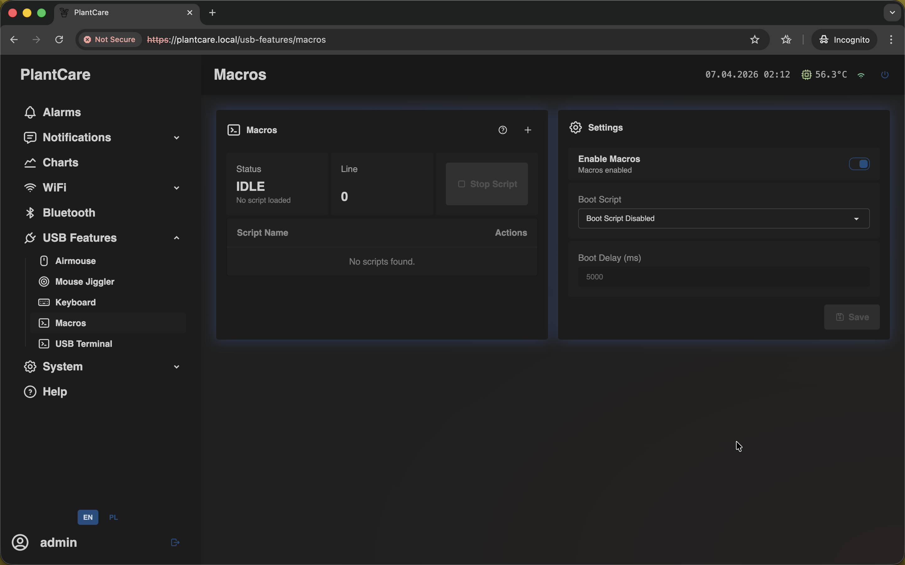
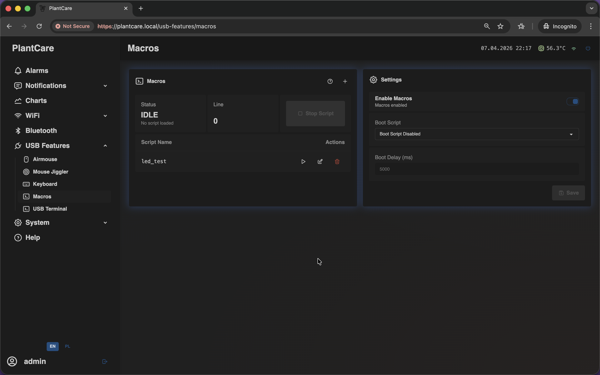
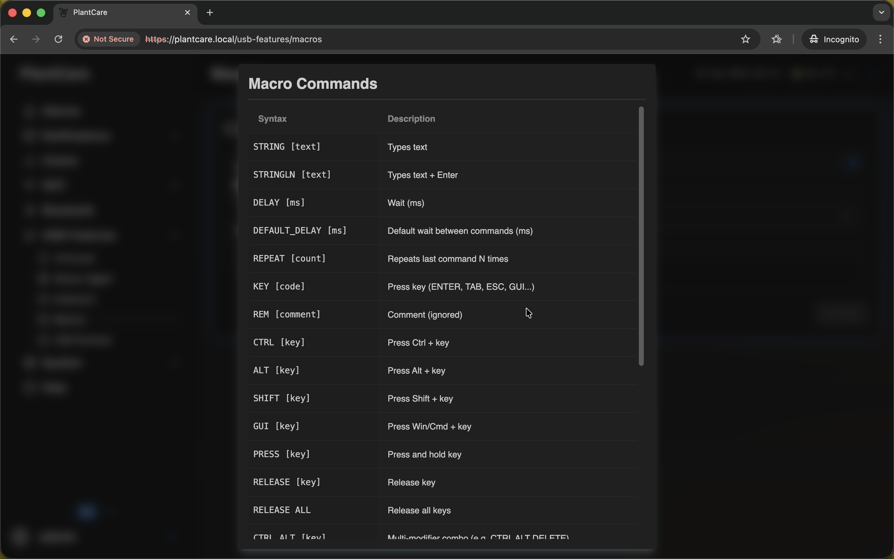
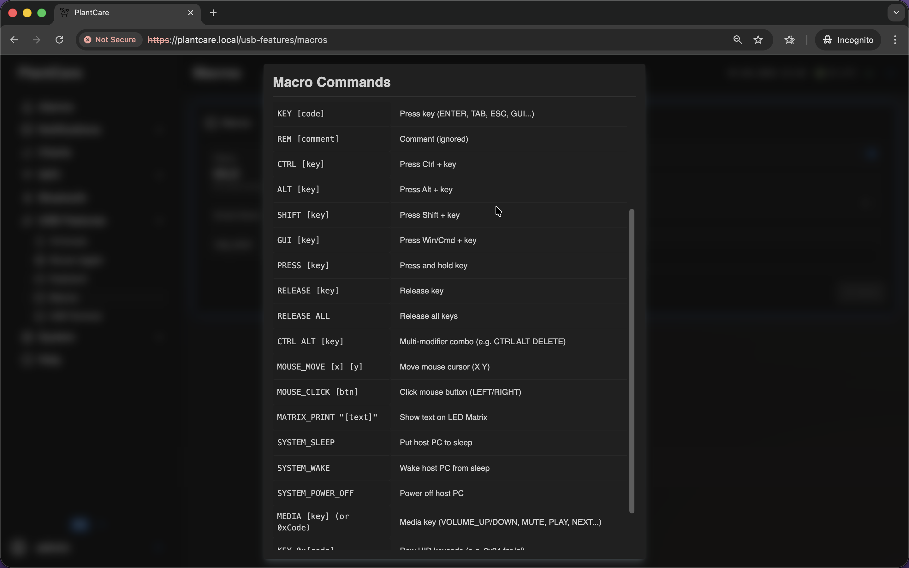
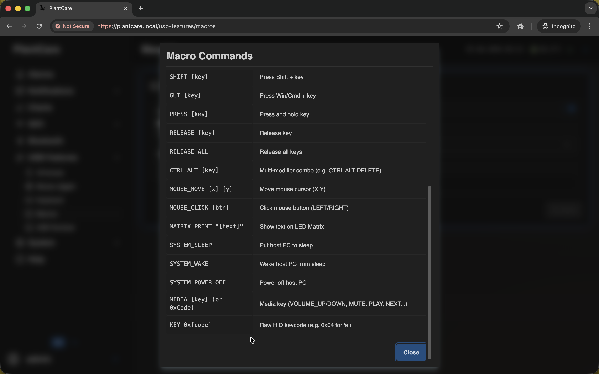
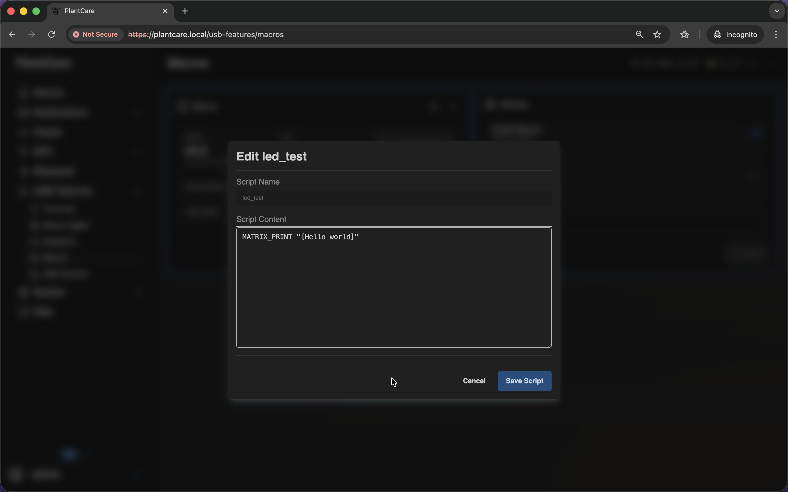
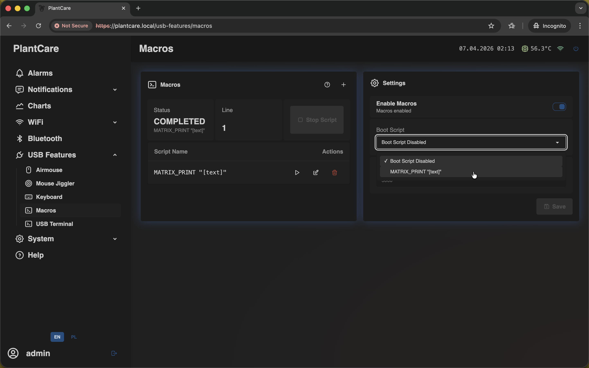
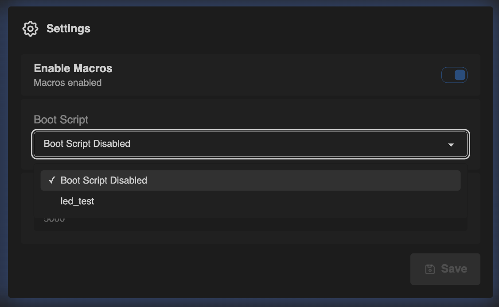

# Macros

Navigation: [Home](../../README.md) · [Basic Flows](../../README.md#basic-use-cases) · [Additional Flows](../../README.md#additional-use-cases) · [Reference](../../README.md#reference-sections) · [USB Features](../usb-features.md)

The `Macros` page manages saved scripts and can optionally run one
automatically at startup.

Admin only: script creation, editing, and runtime control require management
access on current builds.

The page is split into two areas:

- the script list on the left
- macro settings on the right

From the main page you can:

- run a saved script
- stop the current script
- edit a script
- enable or disable macros globally

If no scripts exist yet, the page stays usable: the list shows an empty state,
and the settings panel is still available. That makes `Macros` the natural
starting point for creating the first host automation.

## Script List and Status

The left side shows the current runtime state and the list of saved scripts.

- `Status` shows whether the engine is `IDLE`, `RUNNING`, `PAUSED`, `ERROR`, or
  `COMPLETED`
- `Line` shows the current script line being executed
- the `+` action opens the editor for a new script
- the action buttons let you run, edit, or delete a saved script
- `Stop Script` stops the currently running macro

If macros are disabled globally, the page keeps the saved scripts visible, but
script execution is blocked until macros are enabled again.

## Macro Commands

Scripts are plain text files made of simple macro commands. The command
reference modal shows the supported syntax.

The command reference modal is scrollable, so it is best read as a reference
sheet rather than a single short popup. It covers text, delays, key actions,
mouse actions, LED-related commands, and system-oriented actions:

Examples of what macros can do:

- type text or press `Enter`, `Tab`, `Esc`, and similar keys
- add waits with `DELAY` or `DEFAULT_DELAY`
- send modifier shortcuts such as `CTRL`, `ALT`, `SHIFT`, or `GUI`
- move or click the mouse
- print text on the LED matrix
- send host power or media-related actions

## Editing and Saving Scripts

Creating or editing a macro opens the script editor modal.

Editing opens a modal where you can change the script body directly:

Use the editor to:

- create a new script with a unique file name
- change the content of an existing script
- save the script so it appears in the main list

Saved scripts can later be:

- run manually from the `Macros` page
- selected as a `Boot Script`
- triggered from `Air Mouse` click actions

That last point is what links `Macros` with `Air Mouse`: if you choose a script
under `Single Click`, `Double Click`, or `Triple Click`, the selected Air Mouse
gesture runs the saved macro.

## Settings

The settings panel controls whether macros are active at all and whether one
saved script should run automatically after boot.

- `Enable Macros` turns the macro runtime on or off globally
- `Boot Script` selects which saved script should run automatically
- `Boot Delay (ms)` sets how long the device should wait after boot before
  starting that script

The boot-script area only becomes truly useful after you already have at least
one saved script in the list. Once a script exists, it can be selected from the
dropdown in the settings panel:

## Important Behavior

- changing `Enable Macros` triggers a save flow that asks for restart
- `Boot Script` should point to a script that already exists in the list
- `Boot Delay` is only meaningful when a boot script is selected
- if a boot script is selected while macros are disabled, the page shows a hint
  reminding you that macros must be enabled for the boot script to run

Use this when you want one automation script to start on the next device boot.

## Best Use Cases

Examples:

- create one-click host actions that can later be triggered from `Air Mouse`
- keep a small library of repeated keyboard and mouse sequences for support or
  maintenance work
- define a boot script for a repeatable startup action after the device powers
  on
- store host automation centrally in MatrixHub instead of retyping the same
  steps every time

Navigation: [Home](../../README.md) · [Basic Flows](../../README.md#basic-use-cases) · [Additional Flows](../../README.md#additional-use-cases) · [Reference](../../README.md#reference-sections) · [USB Features](../usb-features.md)
