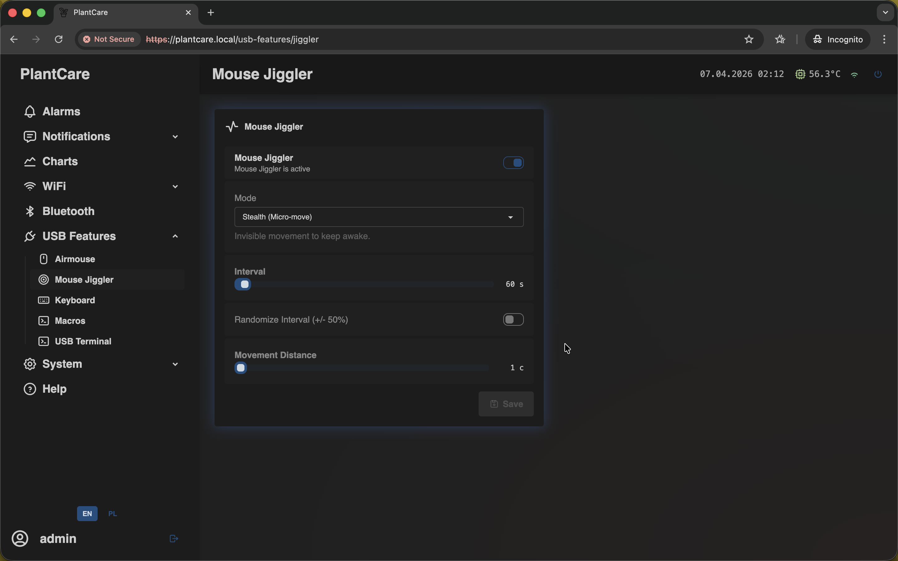
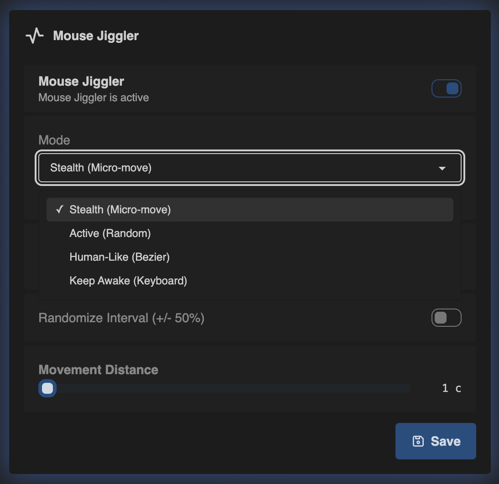

# Mouse Jiggler

Navigation: [Home](../../README.md) · [Basic Flows](../../README.md#basic-use-cases) · [Additional Flows](../../README.md#additional-use-cases) · [Reference](../../README.md#reference-sections) · [USB Features](../usb-features.md)

The `Mouse Jiggler` page provides periodic movement to keep a host awake.

Admin only: this page is available only to users with management access on
current builds.

## Main Controls

The page lets you control:

- whether jiggler is enabled at all
- the movement mode
- the interval between actions
- optional interval randomization
- movement distance for pointer-based modes

The layout is intentionally simple: one card contains everything needed to keep
the connected host awake without opening any other USB page.

## Choosing a Mode

Available modes:

- `Stealth (Micro-move)` keeps the host awake with tiny movements
- `Active (Random)` uses more obvious random movement
- `Human-Like (Bezier)` uses natural curved paths
- `Keep Awake (Keyboard)` sends `F13` instead of moving the cursor

`Randomize Interval (+/- 50%)` varies the delay around the selected value, which
is useful when you want something less predictable than a perfectly fixed
pattern.

## Important Behavior

- turning the jiggler on or off goes through a save flow with restart
  confirmation
- changing mode, interval, randomization, or distance is just a normal save
- `Movement Distance` is hidden in `Keyboard` mode because that mode does not
  move the cursor

Use this page when you want to:

- prevent the host from going idle
- keep a session active during long-running work
- control movement mode, interval, and optional randomization

## Best Use Cases

Examples:

- keep a presentation PC, dashboard screen, or monitoring console awake during
  long unattended sessions
- use `Keep Awake (Keyboard)` when you do not want visible cursor movement on
  the host display
- use `Human-Like (Bezier)` when you want motion that looks less robotic than a
  simple micro-shift

Navigation: [Home](../../README.md) · [Basic Flows](../../README.md#basic-use-cases) · [Additional Flows](../../README.md#additional-use-cases) · [Reference](../../README.md#reference-sections) · [USB Features](../usb-features.md)
