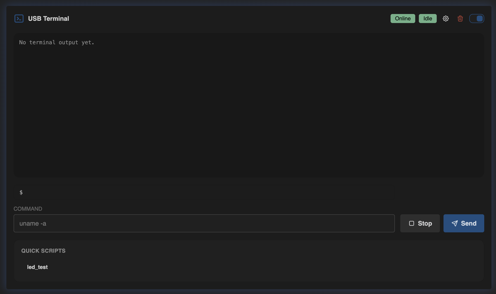
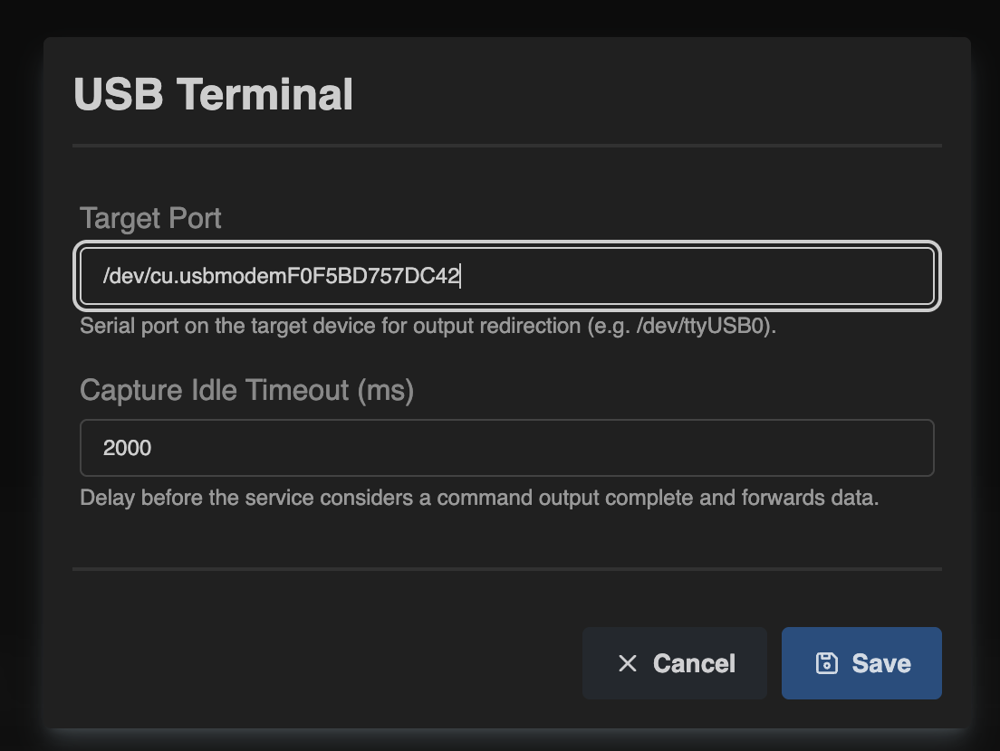
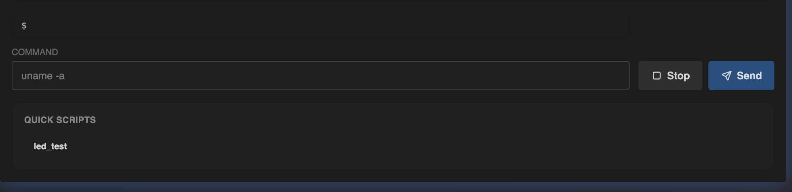

# USB Terminal

Navigation: [Home](../../README.md) · [Basic Flows](../../README.md#basic-use-cases) · [Additional Flows](../../README.md#additional-use-cases) · [Reference](../../README.md#reference-sections) · [USB Features](../usb-features.md)

The `USB Terminal` page provides an interactive command area with status
badges and quick scripts.

Admin only: this page is intended for host-maintenance workflows and is only
available to users with management access.

## Terminal Controls

The page includes:

- a header toggle to enable or disable USB Terminal
- connection and terminal status badges
- a console output area
- a command input field with `Send` and `Stop`
- a `Clear` action for the transcript
- a settings modal for terminal capture options
- a `Quick Scripts` section backed by saved macros

The status badges in the header help you quickly tell whether the USB terminal
service is available and whether it is currently busy. In the example above the
service is `Online`, while the terminal state itself is `Idle`.

## Important Behavior

- turning USB Terminal on or off is saved with restart confirmation
- disabling it is blocked while an active terminal session is still running
- `Target Port` must be filled in before USB Terminal can be enabled
- `Target Port` defines the serial port used for output redirection
- `Capture Idle Timeout` controls how long the service waits before it decides
  that command output is complete
- if macros are enabled and saved scripts exist, they can also be run from the
  `Quick Scripts` section on this page
- if macros are disabled, the page keeps the quick-script area but points you
  back to `USB Features -> Macros`

The settings modal is where terminal capture is made usable for a real host:

## Quick Scripts

The lower `Quick Scripts` area is a shortcut into saved macros. It is useful
when you want one or two repeatable host actions available directly below the
terminal without switching pages.

Use it when you want to:

- run terminal-style actions against the connected host
- reuse quick scripts from the web interface
- monitor the terminal area together with USB feature state

## Best Use Cases

Examples:

- use it as a lightweight web terminal when MatrixHub is attached to a service
  machine over USB
- configure `Target Port` when you want command output captured back into the
  web UI instead of typing blindly
- keep a few saved quick scripts for routine maintenance commands and run them
  without opening the full `Macros` page
- combine terminal access with `Keyboard`, `Air Mouse`, and `Macros` when
  MatrixHub is acting as a compact USB maintenance tool

Navigation: [Home](../../README.md) · [Basic Flows](../../README.md#basic-use-cases) · [Additional Flows](../../README.md#additional-use-cases) · [Reference](../../README.md#reference-sections) · [USB Features](../usb-features.md)
