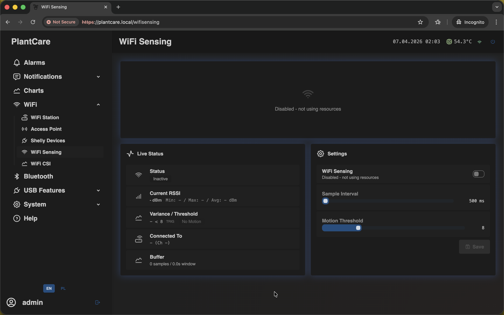
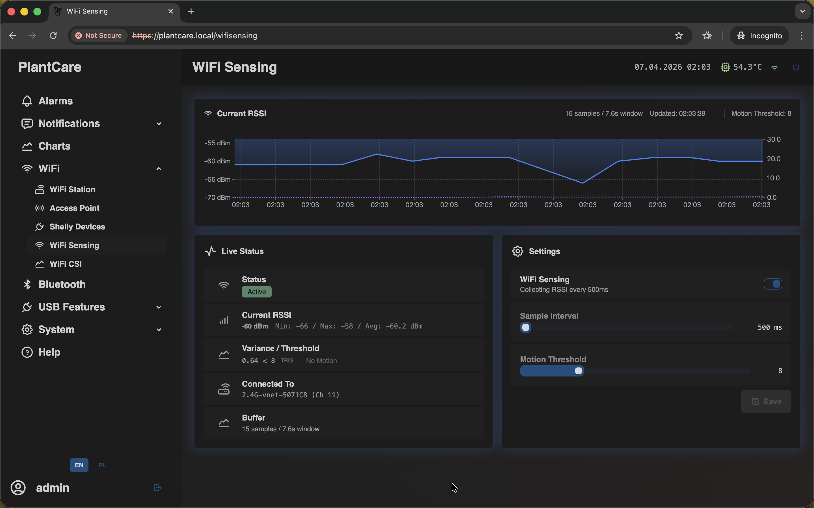
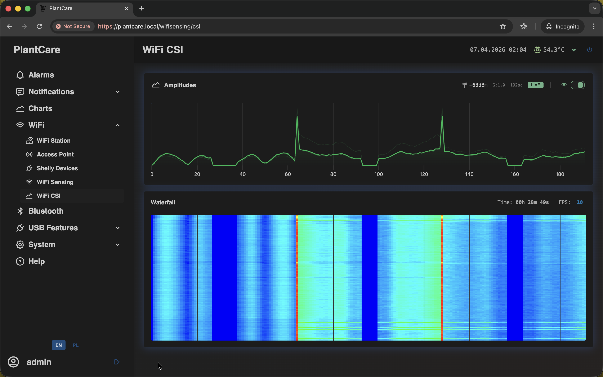

# Wi-Fi Sensing and CSI

Navigation: [Home](../README.md) · [Basic Flows](../README.md#basic-use-cases) · [Additional Flows](../README.md#additional-use-cases) · [Reference](../README.md#reference-sections)

MatrixHub also includes advanced Wi-Fi-based sensing pages.

Diagnostic note: `Wi-Fi Sensing` and `WiFi CSI` are diagnostic or experimental
tools. They are not required for normal temperature, humidity, CO2, alarms, or
notification workflows.

Users with management access can change sensing settings. Other users may only
see the live status views.

This section covers both routes under the same Wi-Fi submenu:

- `/wifisensing` for the main sensing page with status and settings
- `/wifisensing/csi` for the dedicated live CSI view

## Availability

- `WiFi CSI` stays visible in the `WiFi` menu, but it unlocks only when the
  Wi-Fi Station connection is currently active
- if STA is disconnected, treat `WiFi CSI` as a follow-up tool after Wi-Fi
  recovery rather than a first diagnostic step

## Wi-Fi Sensing

When Wi-Fi sensing is disabled, the page shows an inactive state and the
current settings:

When enabled, the page shows current RSSI, variance, thresholds, and a live
chart:

## Wi-Fi CSI

The `WiFi CSI` page provides a more detailed signal view for advanced
diagnostics and experimentation:

Treat these pages as advanced features. They are useful for experimentation,
signal analysis, and development work, but they are not required for the basic
temperature, humidity, CO2, and alarm workflow.

The CSI page is best treated as a read-focused live view: you open it when the
Wi-Fi Station link is already healthy and you want deeper signal detail instead
of day-to-day monitoring settings.

Navigation: [Home](../README.md) · [Basic Flows](../README.md#basic-use-cases) · [Additional Flows](../README.md#additional-use-cases) · [Reference](../README.md#reference-sections)
