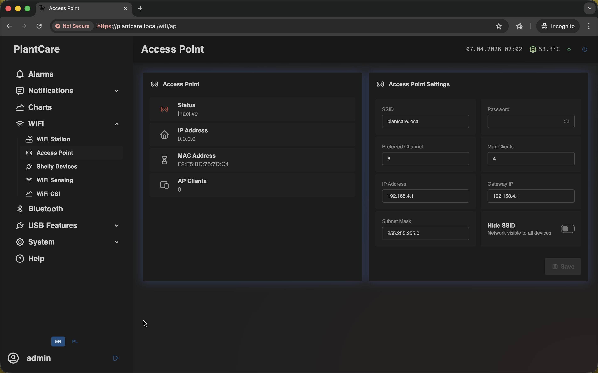

# Wi-Fi Configuration

Navigation: [Home](../README.md) · [Basic Flows](../README.md#basic-use-cases) · [Additional Flows](../README.md#additional-use-cases) · [Reference](../README.md#reference-sections)

This section covers the pages used to manage network access, Access Point
access, and recovery behavior.

The same `WiFi` menu area also contains [Shelly devices](shelly.md),
[Wi-Fi sensing and CSI](wifi-sensing.md), and the related `WiFi CSI` live page.
Those features are documented separately so this page can stay focused on
network access itself.

## WiFi Station

The most important network page is `WiFi Station`. Use it to manage the
regular network connection after the initial setup.

The page combines live connection status, connection settings, and the saved
network list.

On this page you can:

- review the current Wi-Fi status
- check the assigned IP address
- manage saved networks
- choose the Wi-Fi operating mode
- set the hostname used for local name resolution
- configure optional static IP settings per saved network

## Access Point

The `Access Point` page controls the local network used when WiFi Mode is set
to `Access Point`.

Typical use cases for the Access Point page:

- first access after a fresh flash or factory reset with no saved networks
- local access when the operator intentionally switches WiFi Mode to
  `Access Point`
- checking the AP IP address and SSID
- changing local AP parameters for service or installation work

These settings matter during first access and every time MatrixHub is placed in
AP mode.

## Connectivity Behavior

MatrixHub has one explicit Wi-Fi operating mode:

- `off`: Wi-Fi radio is disabled. Internet, Telegram, and local Wi-Fi access
  are unavailable until Wi-Fi is enabled again.
- `ap`: Access Point only. STA reconnects are stopped.
- `sta`: Station only. MatrixHub connects to saved networks and retries with
  backoff when they fail.

Important behavior:

- after a fresh flash or factory reset with no saved networks, MatrixHub starts
  in `ap`
- `sta` requires at least one saved network
- if saved networks exist, `sta` tries them automatically one by one
- if one full cycle fails, the device waits and retries again instead of giving
  up permanently
- `sta` never starts AP automatically after connection failures
- change Wi-Fi mode from the web UI or Matrix menu when you need to move
  between `off`, `ap`, and `sta`

## Recovery and Addressing

The hostname stored in Wi-Fi settings is the short name, usually `matrixhub`.
When local name resolution works, the browser address becomes
`matrixhub.local`.

Some standard builds also use `matrixhub.local` as the visible AP
name, so the same string can appear both as a Wi-Fi network name and as a
browser address.

During setup or recovery you may therefore see:

- a current router-assigned Station IP such as `192.168.x.x`
- an AP address such as `192.168.4.1`
- `No WiFi` on the matrix IP screen when nothing is currently connected

For a compact summary of these rules, see
[Behavior and availability](../appendix/behavior-and-availability.md).

## Related Areas Under the WiFi Menu

- [Shelly devices](shelly.md) for LAN relay and telemetry integration
- [Wi-Fi sensing and CSI](wifi-sensing.md) for advanced signal-based diagnostic
  pages
- [Get online and connect to home Wi-Fi](../flows/basic/get-online-and-connect-home-wifi.md)

Navigation: [Home](../README.md) · [Basic Flows](../README.md#basic-use-cases) · [Additional Flows](../README.md#additional-use-cases) · [Reference](../README.md#reference-sections)
